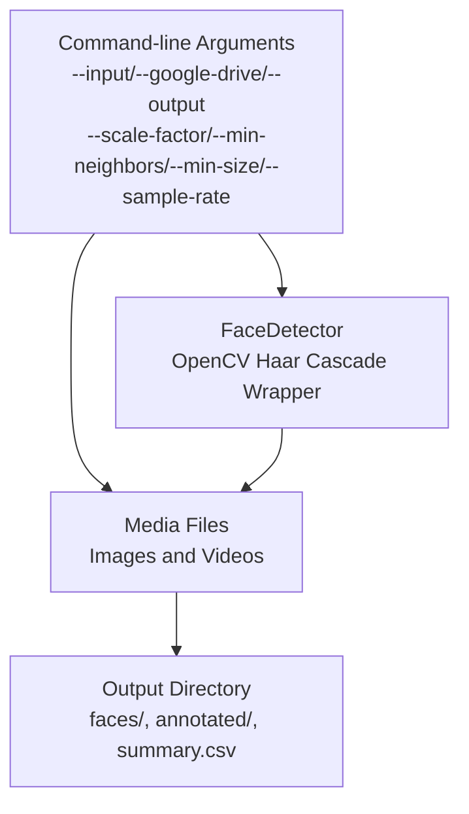
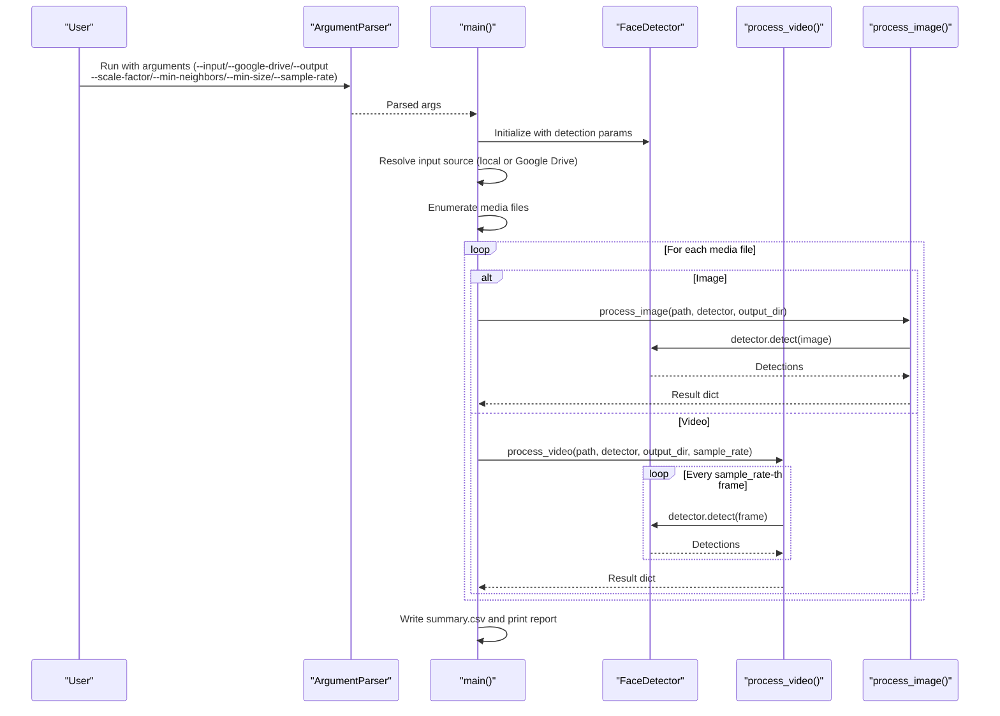
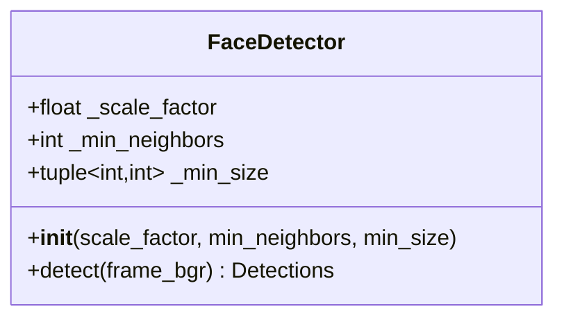
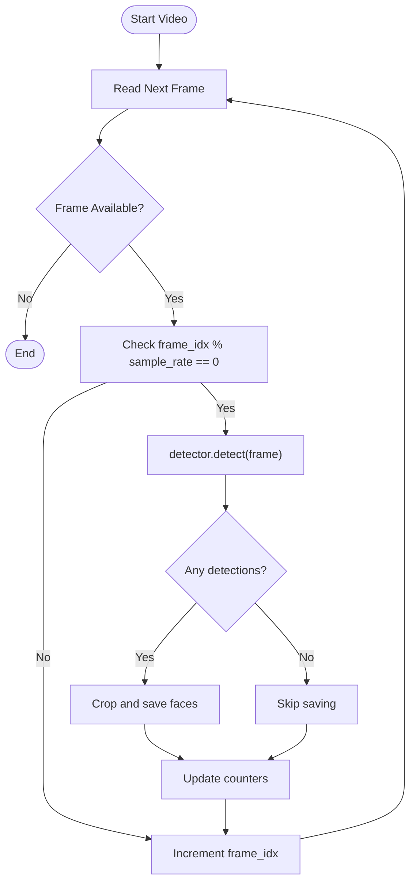
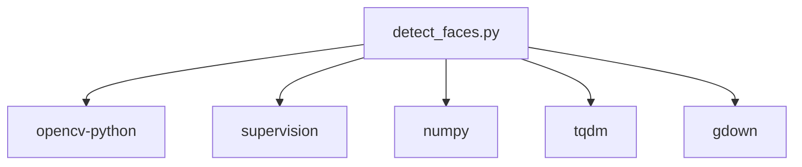

# Configuration and Parameters

<cite>
**Referenced Files in This Document**
- [detect_faces.py](file://detect_faces.py)
- [requirements.txt](file://requirements.txt)
</cite>

## Table of Contents
1. [Introduction](#introduction)
2. [Project Structure](#project-structure)
3. [Core Components](#core-components)
4. [Architecture Overview](#architecture-overview)
5. [Detailed Component Analysis](#detailed-component-analysis)
6. [Dependency Analysis](#dependency-analysis)
7. [Performance Considerations](#performance-considerations)
8. [Troubleshooting Guide](#troubleshooting-guide)
9. [Conclusion](#conclusion)

## Introduction
This document explains CaptureFace’s configuration options and command-line parameters. It focuses on how to configure input/output directories, detection parameters (scale_factor, min_neighbors, min_size), and video processing settings (sample_rate). It also provides parameter tuning strategies, optimization guidelines for different scenarios, and troubleshooting guidance for parameter-related issues.

## Project Structure
CaptureFace is a single-file Python application that:
- Accepts command-line arguments for input source, output directory, and detection/video parameters
- Supports local folders or Google Drive URLs/IDs
- Processes images and videos, detects faces using OpenCV Haar Cascades, annotates results, and saves cropped face images
- Produces a summary CSV and prints a per-file breakdown

**Diagram sources**
- [detect_faces.py:291-447](file://detect_faces.py#L291-L447)

**Section sources**
- [detect_faces.py:10-14](file://detect_faces.py#L10-L14)
- [detect_faces.py:291-447](file://detect_faces.py#L291-L447)

## Core Components
This section documents all command-line arguments and internal parameters that influence detection behavior and performance.

- Input selection
  - --input, -i: Local folder containing photos and/or videos to scan.
  - --google-drive, -gd: Google Drive shared folder URL or file/folder ID. Files are downloaded to a temporary folder before processing.
- Output configuration
  - --output, -o: Folder where results will be saved (default: ./output). Contains:
    - faces/<source>/crop_*.jpg: Cropped face images
    - annotated/<source>.jpg: Annotated images (images only)
    - summary.csv: Per-file summary of detections
- Detection parameters (applied to OpenCV Haar Cascades)
  - --scale-factor: Haar cascade scale factor per image pyramid step (default: 1.1)
  - --min-neighbors: Minimum neighbors each candidate rectangle should have to be kept (default: 5)
  - --min-size: Minimum face size in pixels (two integers W H; default: 30 30)
- Video processing settings
  - --sample-rate: Process every N-th frame in videos (default: 5)

Effects on detection accuracy and performance:
- scale_factor
  - Larger values reduce recall (may miss small faces) but increase speed
  - Smaller values improve recall but increase computation cost
- min_neighbors
  - Higher values reduce false positives but may drop true positives if set too high
  - Lower values increase false positives but improve recall
- min_size
  - Larger values reduce false positives and noise but may miss small faces
  - Smaller values improve recall but increase false positives
- sample_rate
  - Larger values increase processing time and memory usage
  - Smaller values reduce accuracy for motion-heavy scenes and fast movement

**Section sources**
- [detect_faces.py:291-346](file://detect_faces.py#L291-L346)
- [detect_faces.py:99-137](file://detect_faces.py#L99-L137)
- [detect_faces.py:227-286](file://detect_faces.py#L227-L286)

## Architecture Overview
The parameter pipeline flows from CLI parsing to detector initialization and media processing.

**Diagram sources**
- [detect_faces.py:291-447](file://detect_faces.py#L291-L447)
- [detect_faces.py:99-137](file://detect_faces.py#L99-L137)
- [detect_faces.py:185-223](file://detect_faces.py#L185-L223)
- [detect_faces.py:227-286](file://detect_faces.py#L227-L286)

## Detailed Component Analysis

### Command-Line Argument Reference
- --input, -i
  - Type: Path
  - Purpose: Local folder containing photos and/or videos to scan
  - Notes: Mutually exclusive with --google-drive
- --google-drive, -gd
  - Type: String
  - Purpose: Google Drive shared folder URL or file/folder ID
  - Behavior: Downloads files to a temporary folder before processing
- --output, -o
  - Type: Path
  - Default: ./output
  - Purpose: Results destination folder
- --scale-factor
  - Type: Float
  - Default: 1.1
  - Effect: Controls image pyramid scaling for detection
- --min-neighbors
  - Type: Int
  - Default: 5
  - Effect: Minimum number of candidate rectangles to retain a detection
- --min-size
  - Type: Two ints (W H)
  - Default: 30 30
  - Effect: Minimum face size in pixels
- --sample-rate
  - Type: Int
  - Default: 5
  - Effect: Frame sampling rate for video processing

Parameter-to-behavior mapping:
- scale_factor influences detection sensitivity and speed
- min_neighbors controls acceptance threshold for detections
- min_size filters detections by physical size
- sample_rate trades off accuracy vs. speed for videos

**Section sources**
- [detect_faces.py:291-346](file://detect_faces.py#L291-L346)

### FaceDetector Class
The detector wraps OpenCV Haar Cascades and exposes a unified interface for detection.

Key behaviors:
- Loads the default frontal face cascade from OpenCV data
- Converts frames to grayscale and equalizes histogram for robustness
- Calls detectMultiScale with configured parameters
- Returns supervision Detections with bounding boxes, confidences, and class IDs

**Diagram sources**
- [detect_faces.py:99-137](file://detect_faces.py#L99-L137)

**Section sources**
- [detect_faces.py:99-137](file://detect_faces.py#L99-L137)

### Video Processing Settings
Video processing reads every N-th frame based on sample_rate to balance performance and coverage.

Key behaviors:
- Uses VideoCapture to iterate frames
- Skips frames until frame_idx % sample_rate == 0
- Applies detector.detect on sampled frames
- Saves cropped faces per sampled frame with a frame-indexed prefix

**Diagram sources**
- [detect_faces.py:227-286](file://detect_faces.py#L227-L286)

**Section sources**
- [detect_faces.py:227-286](file://detect_faces.py#L227-L286)

### Parameter Tuning Strategies
- Accuracy-first tuning
  - Lower scale_factor (e.g., closer to 1.05) to improve recall
  - Lower min_neighbors (e.g., 3–4) to reduce missed detections
  - Lower min_size (e.g., 20–25) to capture smaller faces
  - Reduce sample_rate (e.g., 2–3) for higher temporal resolution in videos
- Speed-first tuning
  - Increase scale_factor (e.g., 1.2–1.3) to reduce iterations
  - Increase min_neighbors (e.g., 6–8) to prune false positives quickly
  - Increase min_size (e.g., 40–50) to filter out noise early
  - Increase sample_rate (e.g., 10–20) to reduce frame processing
- Balanced tuning
  - Start with defaults and adjust one parameter at a time
  - Observe trade-offs between false positives/negatives and runtime
- Scenario-specific guidance
  - Close-up portraits: lower min_size, moderate min_neighbors
  - Group photos: moderate min_size, higher min_neighbors
  - Low-light or low-quality images: consider lowering min_neighbors slightly
  - Fast-motion videos: reduce sample_rate or use higher min_neighbors to stabilize detections

[No sources needed since this section provides general guidance]

### Relationship Between Parameters and Detection Quality
- scale_factor
  - Lower values increase detection attempts across scales, improving recall but slowing down
  - Higher values reduce attempts, increasing speed but risking missed detections
- min_neighbors
  - Acts as a smoothing threshold; higher values reduce false positives but risk missing valid detections
  - Lower values increase recall but may include false positives
- min_size
  - Constrains detection to physically plausible sizes; larger thresholds reduce noise but miss small faces
  - Smaller thresholds improve recall but increase false positives
- sample_rate
  - Reduces computational load by skipping frames; improves speed at the cost of temporal granularity
  - Lower values preserve motion details but increase processing time

[No sources needed since this section provides general guidance]

## Dependency Analysis
External dependencies and their roles:
- opencv-python: Provides Haar Cascade detection and video/image I/O
- supervision: Provides Detections and annotation utilities
- numpy: Numerical operations for image arrays
- tqdm: Progress bars during processing
- gdown: Google Drive download support

**Diagram sources**
- [detect_faces.py:28-32](file://detect_faces.py#L28-L32)
- [requirements.txt:1-6](file://requirements.txt#L1-L6)

**Section sources**
- [detect_faces.py:28-32](file://detect_faces.py#L28-L32)
- [requirements.txt:1-6](file://requirements.txt#L1-L6)

## Performance Considerations
- Detection parameters
  - Increase min_neighbors and min_size to reduce false positives and prune early
  - Increase scale_factor moderately to reduce iterations
- Video processing
  - Increase sample_rate to reduce frame count and accelerate processing
  - Consider adjusting min_neighbors to stabilize detections across frames
- I/O and memory
  - Ensure sufficient disk space in the output directory for cropped faces
  - Use smaller min_size and moderate sample_rate for resource-constrained environments
- Preprocessing
  - The detector applies histogram equalization internally to improve contrast

[No sources needed since this section provides general guidance]

## Troubleshooting Guide
Common parameter-related issues and resolutions:
- No faces detected
  - Reduce min_neighbors and min_size slightly
  - Lower scale_factor to improve recall
  - Verify lighting conditions and image quality
- Too many false positives
  - Increase min_neighbors and min_size
  - Increase scale_factor moderately
  - Consider higher-resolution input or better lighting
- Slow processing
  - Increase sample_rate for videos
  - Increase min_neighbors and min_size to prune early
  - Increase scale_factor moderately
- Missing faces in motion-heavy videos
  - Reduce sample_rate to process more frames
  - Adjust min_neighbors to stabilize detections across frames
- Input source errors
  - Ensure --input points to an existing directory or use --google-drive with a valid URL/ID
  - If using Google Drive, confirm network connectivity and permissions

**Section sources**
- [detect_faces.py:354-366](file://detect_faces.py#L354-L366)
- [detect_faces.py:227-286](file://detect_faces.py#L227-L286)
- [detect_faces.py:99-137](file://detect_faces.py#L99-L137)

## Conclusion
CaptureFace’s configuration centers on four key areas: input selection, output destination, detection parameters, and video sampling. By tuning scale_factor, min_neighbors, min_size, and sample_rate, users can optimize for accuracy, speed, or a balanced outcome depending on their scenario. Start with defaults, iterate carefully, and validate results on representative datasets before applying to production workloads.