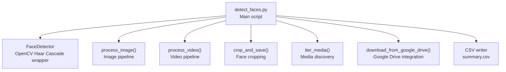
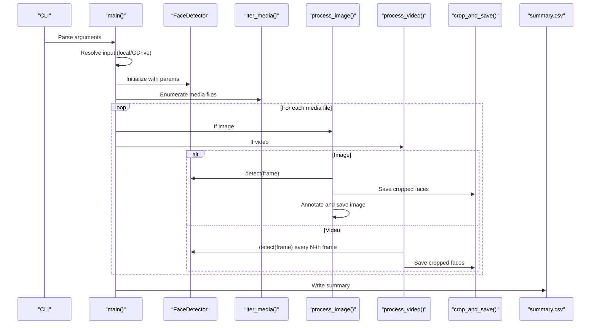
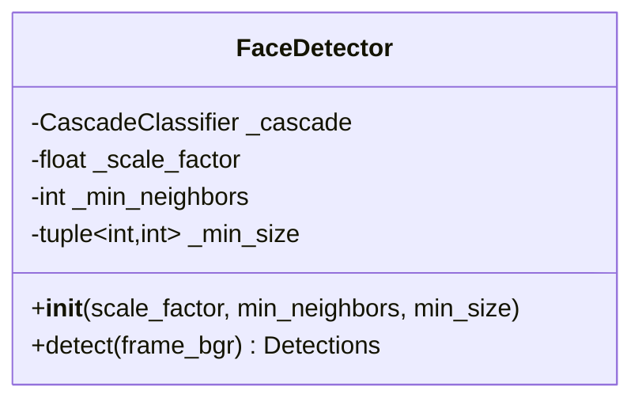
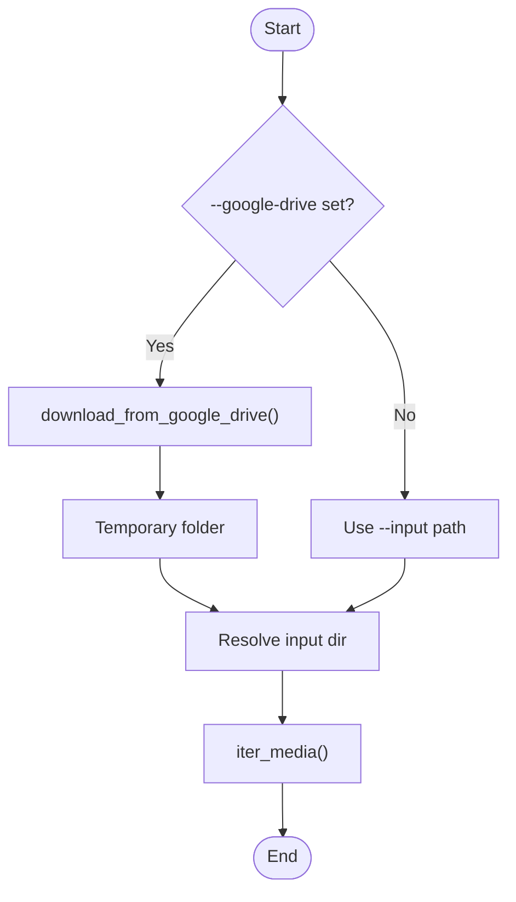
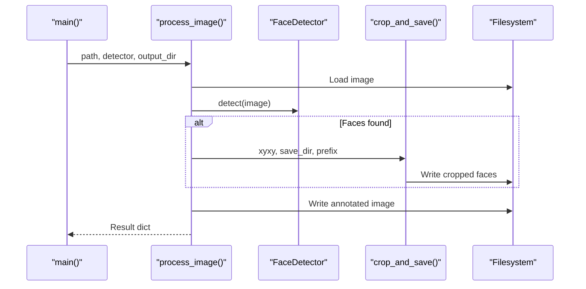
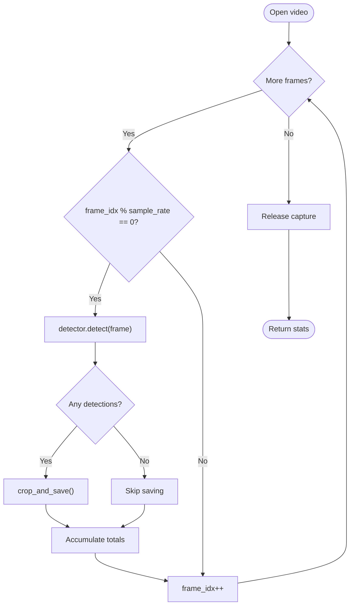
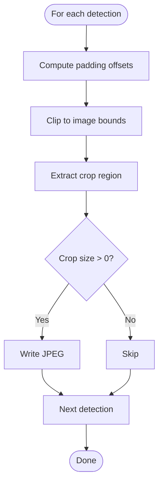
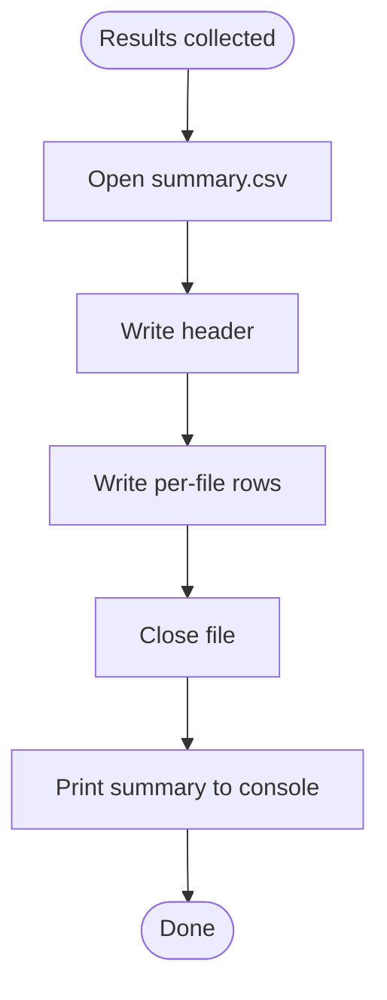
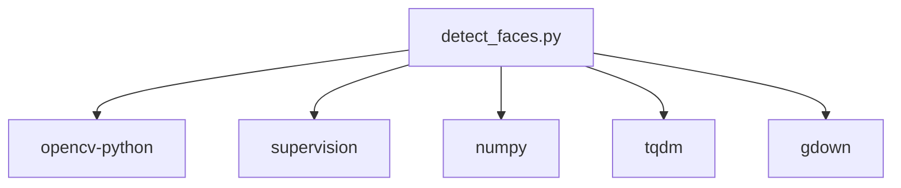

# Core Functionality

<cite>
**Referenced Files in This Document**
- [detect_faces.py](file://detect_faces.py)
- [requirements.txt](file://requirements.txt)
</cite>

## Table of Contents
1. [Introduction](#introduction)
2. [Project Structure](#project-structure)
3. [Core Components](#core-components)
4. [Architecture Overview](#architecture-overview)
5. [Detailed Component Analysis](#detailed-component-analysis)
6. [Dependency Analysis](#dependency-analysis)
7. [Performance Considerations](#performance-considerations)
8. [Troubleshooting Guide](#troubleshooting-guide)
9. [Conclusion](#conclusion)

## Introduction
This document explains the core functionality of CaptureFace, focusing on the face detection engine, media processing workflows, and output generation systems. It covers the OpenCV Haar Cascade implementation, detection parameter configuration, batch processing capabilities, face cropping mechanisms, annotation generation, and CSV reporting features. It also documents the processing pipeline for both images and videos, including frame sampling strategies for video optimization, and describes the FaceDetector class, helper functions, and the overall processing architecture.

## Project Structure
CaptureFace is a single-file Python application that orchestrates face detection across images and videos. It supports local folders and Google Drive inputs, initializes a face detector, processes media files, generates cropped face images, annotates detections, and writes a CSV summary report.



**Diagram sources**
- [detect_faces.py:99-137](file://detect_faces.py#L99-L137)
- [detect_faces.py:185-223](file://detect_faces.py#L185-L223)
- [detect_faces.py:227-286](file://detect_faces.py#L227-L286)
- [detect_faces.py:152-181](file://detect_faces.py#L152-L181)
- [detect_faces.py:141-146](file://detect_faces.py#L141-L146)
- [detect_faces.py:65-94](file://detect_faces.py#L65-L94)
- [detect_faces.py:411-418](file://detect_faces.py#L411-L418)

**Section sources**
- [detect_faces.py:1-14](file://detect_faces.py#L1-L14)
- [detect_faces.py:34-36](file://detect_faces.py#L34-L36)
- [detect_faces.py:291-346](file://detect_faces.py#L291-L346)

## Core Components
- FaceDetector: Encapsulates OpenCV Haar Cascade loading and detection logic with configurable parameters.
- Media discovery: Recursively enumerates supported image and video files.
- Image processing: Loads an image, runs detection, saves cropped faces, and writes an annotated image.
- Video processing: Iterates frames at a configurable sample rate, detects faces, saves crops, and aggregates counts.
- Annotation and cropping: Uses supervision utilities for bounding boxes and labels; crops faces with optional padding.
- Output generation: Writes a CSV summary and prints a console summary.

Key responsibilities:
- Detection parameterization: scale factor, neighbor threshold, and minimum face size.
- Batch processing: Iterates over discovered media files and dispatches to image or video handlers.
- Output organization: Creates dedicated subfolders for faces and annotated images; writes CSV with per-file metrics.

**Section sources**
- [detect_faces.py:99-137](file://detect_faces.py#L99-L137)
- [detect_faces.py:141-146](file://detect_faces.py#L141-L146)
- [detect_faces.py:185-223](file://detect_faces.py#L185-L223)
- [detect_faces.py:227-286](file://detect_faces.py#L227-L286)
- [detect_faces.py:152-181](file://detect_faces.py#L152-L181)
- [detect_faces.py:411-418](file://detect_faces.py#L411-L418)

## Architecture Overview
The system follows a modular pipeline:
- CLI parsing resolves input source (local or Google Drive).
- A FaceDetector instance is initialized with configured parameters.
- Media files are discovered and processed in order.
- For each file, detection is performed and outputs are generated.
- A CSV summary captures per-file results.



**Diagram sources**
- [detect_faces.py:291-346](file://detect_faces.py#L291-L346)
- [detect_faces.py:376-418](file://detect_faces.py#L376-L418)
- [detect_faces.py:185-223](file://detect_faces.py#L185-L223)
- [detect_faces.py:227-286](file://detect_faces.py#L227-L286)
- [detect_faces.py:152-181](file://detect_faces.py#L152-L181)

## Detailed Component Analysis

### FaceDetector Class
The FaceDetector wraps OpenCV’s Haar Cascade classifier and exposes a unified detection interface returning supervision Detections.

Implementation highlights:
- Initialization loads the default frontal face cascade from OpenCV’s data directory and validates readiness.
- Detection pipeline:
  - Converts BGR frame to grayscale.
  - Applies histogram equalization to improve contrast.
  - Runs detectMultiScale with configurable scale factor, neighbor threshold, and minimum size.
  - Translates rectangles to supervision Detections with xyxy coordinates, unit confidence, and zero class id.
- Returns empty detections when no faces are found.



**Diagram sources**
- [detect_faces.py:99-137](file://detect_faces.py#L99-L137)

**Section sources**
- [detect_faces.py:99-137](file://detect_faces.py#L99-L137)

### Media Discovery and Input Resolution
- iter_media recursively yields all supported image and video files under a given folder.
- Google Drive support:
  - Extracts folder or file ID from URLs or raw IDs.
  - Downloads shared content into a temporary directory.
  - Adjusts the input path to the downloaded content if a single subfolder was created.



**Diagram sources**
- [detect_faces.py:48-94](file://detect_faces.py#L48-L94)
- [detect_faces.py:141-146](file://detect_faces.py#L141-L146)
- [detect_faces.py:351-365](file://detect_faces.py#L351-L365)

**Section sources**
- [detect_faces.py:48-94](file://detect_faces.py#L48-L94)
- [detect_faces.py:141-146](file://detect_faces.py#L141-L146)

### Image Processing Pipeline
- Loads the image with OpenCV.
- Runs FaceDetector.detect to obtain supervision Detections.
- Saves cropped faces into a per-image subfolder under the faces directory.
- Generates an annotated image with labeled bounding boxes and writes it to the annotated directory.
- Returns a dictionary with file metadata, type, face counts, and saved face counts.



**Diagram sources**
- [detect_faces.py:185-223](file://detect_faces.py#L185-L223)
- [detect_faces.py:152-181](file://detect_faces.py#L152-L181)
- [detect_faces.py:99-137](file://detect_faces.py#L99-L137)

**Section sources**
- [detect_faces.py:185-223](file://detect_faces.py#L185-L223)
- [detect_faces.py:152-181](file://detect_faces.py#L152-L181)

### Video Processing Pipeline and Frame Sampling
- Opens the video with OpenCV VideoCapture.
- Iterates frames and processes every N-th frame according to the sample rate to optimize performance.
- For each sampled frame:
  - Runs FaceDetector.detect.
  - Aggregates total faces and saves cropped faces with a frame-indexed prefix.
- Returns a dictionary with file metadata, processed frame count, total faces, and saved face count.



**Diagram sources**
- [detect_faces.py:227-286](file://detect_faces.py#L227-L286)
- [detect_faces.py:152-181](file://detect_faces.py#L152-L181)
- [detect_faces.py:99-137](file://detect_faces.py#L99-L137)

**Section sources**
- [detect_faces.py:227-286](file://detect_faces.py#L227-L286)

### Face Cropping Mechanism
- Computes padding around each detected rectangle as a fraction of width/height.
- Clips crop coordinates to image boundaries.
- Writes each cropped face to a JPEG file named with a prefix and index.
- Returns the list of saved paths.



**Diagram sources**
- [detect_faces.py:152-181](file://detect_faces.py#L152-L181)

**Section sources**
- [detect_faces.py:152-181](file://detect_faces.py#L152-L181)

### Annotation Generation
- Creates a copy of the image and annotates detections with boxes and labels using supervision’s BoxAnnotator and LabelAnnotator.
- Writes the annotated image to the annotated output directory.

```mermaid
sequenceDiagram
participant ImgProc as "process_image()"
participant Copy as "Copy image"
participant Box as "BoxAnnotator"
participant Label as "LabelAnnotator"
participant FS as "Filesystem"
ImgProc->>Copy : Create annotated image
ImgProc->>Box : Annotate with detections
ImgProc->>Label : Add labels
ImgProc->>FS : Save annotated image
```

**Diagram sources**
- [detect_faces.py:204-215](file://detect_faces.py#L204-L215)

**Section sources**
- [detect_faces.py:204-215](file://detect_faces.py#L204-L215)

### CSV Reporting
- Writes a CSV file with headers for file, type, faces, saved_faces, and error.
- Populates rows with per-file results collected during processing.
- Prints a console summary including total files processed, total faces found, and total face crops saved.



**Diagram sources**
- [detect_faces.py:411-418](file://detect_faces.py#L411-L418)
- [detect_faces.py:419-436](file://detect_faces.py#L419-L436)

**Section sources**
- [detect_faces.py:411-418](file://detect_faces.py#L411-L418)
- [detect_faces.py:419-436](file://detect_faces.py#L419-L436)

## Dependency Analysis
External libraries and their roles:
- OpenCV: Image/video I/O, Haar Cascade detection, and image writing.
- supervision: Drawing bounding boxes and labels on images.
- NumPy: Numerical arrays for detections and image operations.
- tqdm: Progress bars for interactive feedback.
- gdown: Downloading files from Google Drive.



**Diagram sources**
- [requirements.txt:1-6](file://requirements.txt#L1-L6)

**Section sources**
- [requirements.txt:1-6](file://requirements.txt#L1-L6)

## Performance Considerations
- Frame sampling for videos: The sample rate parameter controls how many frames are processed, trading off accuracy for speed. Lower values increase throughput but reduce temporal coverage.
- Histogram equalization: Improves detection robustness under varying lighting conditions.
- Memory efficiency: Images are loaded once per file; video frames are processed incrementally.
- Output I/O: Cropped faces and annotated images are written per detection; ensure sufficient disk space and I/O bandwidth.

[No sources needed since this section provides general guidance]

## Troubleshooting Guide
Common issues and resolutions:
- Cannot initialize detector: The cascade file must be available in OpenCV’s data directory. Verify installation and environment.
- Cannot read image: The image path may be invalid or unreadable. Check permissions and file integrity.
- Cannot open video: The video may be corrupted or inaccessible. Verify codec support and file integrity.
- No faces detected: Adjust detection parameters (scale factor, neighbor threshold, minimum size) to balance sensitivity and precision.
- Insufficient disk space: Ensure the output directory has adequate free space for cropped faces and annotated images.
- Google Drive download failures: Confirm network connectivity and that the shared link or ID is accessible.

**Section sources**
- [detect_faces.py:106-107](file://detect_faces.py#L106-L107)
- [detect_faces.py:192-193](file://detect_faces.py#L192-L193)
- [detect_faces.py:238-239](file://detect_faces.py#L238-L239)
- [detect_faces.py:368-374](file://detect_faces.py#L368-L374)

## Conclusion
CaptureFace provides a streamlined, configurable pipeline for detecting faces in images and videos. Its modular design centers on the FaceDetector class, efficient video sampling, robust cropping and annotation, and a clear CSV reporting mechanism. By tuning detection parameters and sample rates, users can balance accuracy, performance, and resource usage effectively.