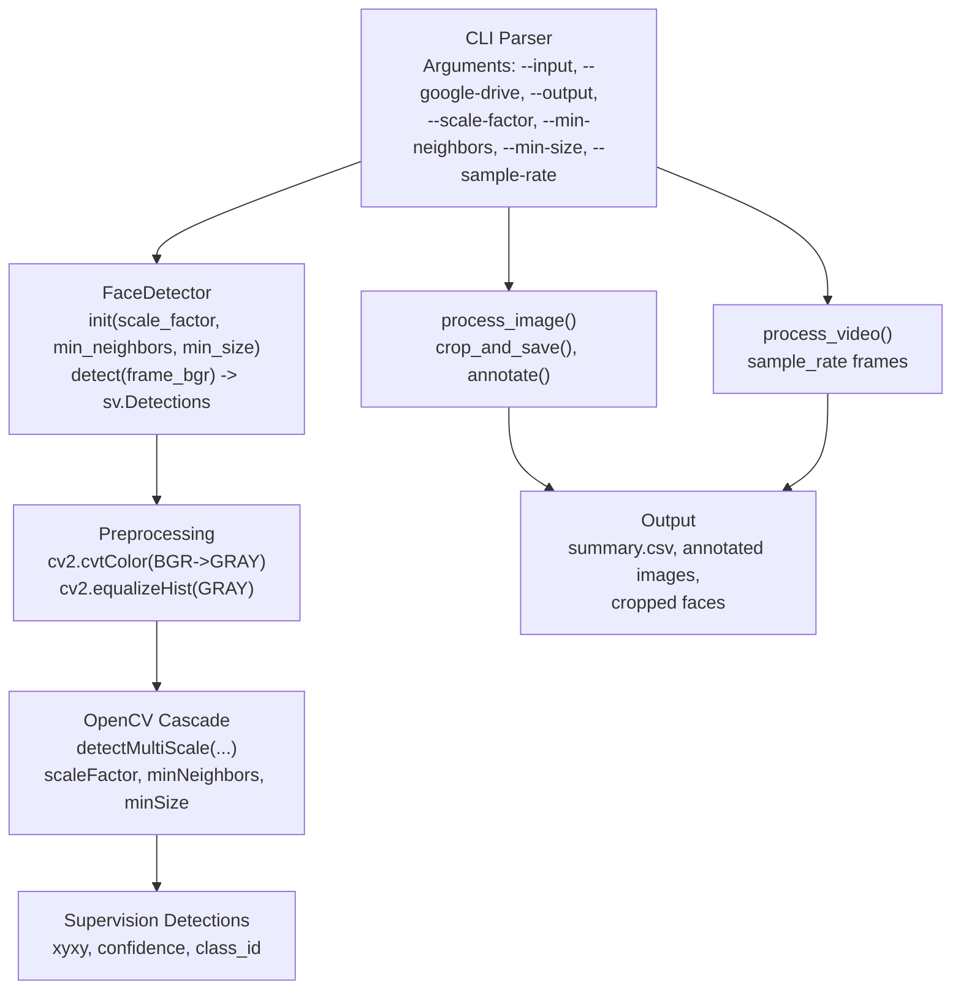
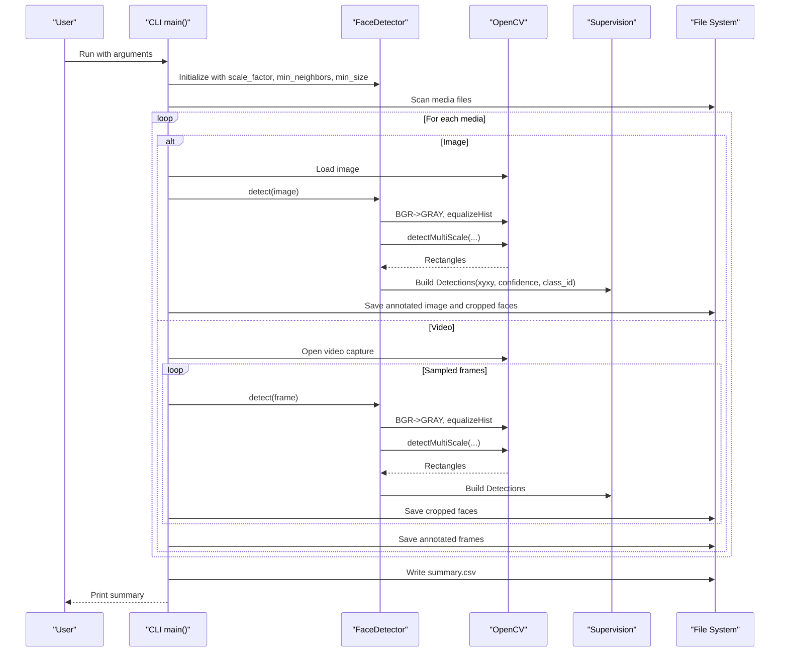
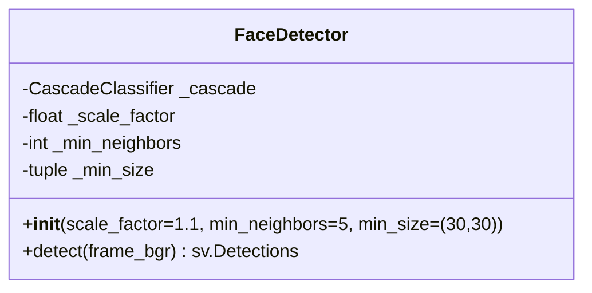
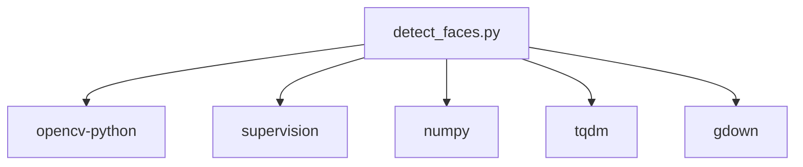

# Face Detection Engine

<cite>
**Referenced Files in This Document**
- [detect_faces.py](file://detect_faces.py)
- [requirements.txt](file://requirements.txt)
</cite>

## Table of Contents
1. [Introduction](#introduction)
2. [Project Structure](#project-structure)
3. [Core Components](#core-components)
4. [Architecture Overview](#architecture-overview)
5. [Detailed Component Analysis](#detailed-component-analysis)
6. [Dependency Analysis](#dependency-analysis)
7. [Performance Considerations](#performance-considerations)
8. [Troubleshooting Guide](#troubleshooting-guide)
9. [Conclusion](#conclusion)
10. [Appendices](#appendices)

## Introduction
This document explains the face detection engine implemented in the repository, focusing on the FaceDetector class powered by OpenCV Haar Cascades and integrated with the supervision library. It covers initialization parameters, preprocessing steps, detection algorithm behavior, parameter tuning, coordinate system transformations, confidence scoring, and practical optimization tips. It also documents how detection results are transformed into supervision Detections and annotated for visualization.

## Project Structure
The repository centers around a single script that orchestrates face detection across images and videos. The key elements are:
- A command-line interface for input selection and parameter configuration
- A FaceDetector class wrapping OpenCV’s Haar cascade classifier
- Preprocessing pipeline (grayscale conversion and histogram equalization)
- Supervision integration for detection results and visualization
- Media scanning and processing utilities for images and videos

**Diagram sources**
- [detect_faces.py:291-346](file://detect_faces.py#L291-L346)
- [detect_faces.py:99-137](file://detect_faces.py#L99-L137)
- [detect_faces.py:185-222](file://detect_faces.py#L185-L222)
- [detect_faces.py:227-286](file://detect_faces.py#L227-L286)

**Section sources**
- [detect_faces.py:18-33](file://detect_faces.py#L18-L33)
- [detect_faces.py:291-346](file://detect_faces.py#L291-L346)

## Core Components
- FaceDetector: Wraps OpenCV’s Haar cascade classifier and exposes a unified detect method returning supervision Detections.
- Preprocessing: Converts BGR frames to grayscale and applies histogram equalization to improve detection robustness under varying illumination.
- Supervision Integration: Translates raw rectangles from detectMultiScale into supervision Detections with standardized xyxy coordinates, constant confidence, and zero-class IDs.
- Media Processing: Applies detection to images and sampled video frames, saving annotated images and cropped face regions.

Key implementation references:
- FaceDetector initialization and detect method: [detect_faces.py:99-137](file://detect_faces.py#L99-L137)
- Preprocessing and detectMultiScale call: [detect_faces.py:112-123](file://detect_faces.py#L112-L123)
- Supervision Detections construction: [detect_faces.py:132-136](file://detect_faces.py#L132-L136)
- Image processing and annotation: [detect_faces.py:185-222](file://detect_faces.py#L185-L222)
- Video processing and sampling: [detect_faces.py:227-286](file://detect_faces.py#L227-L286)

**Section sources**
- [detect_faces.py:99-137](file://detect_faces.py#L99-L137)
- [detect_faces.py:185-222](file://detect_faces.py#L185-L222)
- [detect_faces.py:227-286](file://detect_faces.py#L227-L286)

## Architecture Overview
The system follows a modular pipeline:
- CLI parses arguments and selects input source (local folder or Google Drive).
- FaceDetector is instantiated with configurable parameters.
- For each media item:
  - Images: loaded, detected, annotated, and cropped faces saved.
  - Videos: sampled frames are detected, annotated, and cropped faces saved.
- Results are summarized to CSV and printed.

**Diagram sources**
- [detect_faces.py:291-346](file://detect_faces.py#L291-L346)
- [detect_faces.py:99-137](file://detect_faces.py#L99-L137)
- [detect_faces.py:185-222](file://detect_faces.py#L185-L222)
- [detect_faces.py:227-286](file://detect_faces.py#L227-L286)

## Detailed Component Analysis

### FaceDetector Class
The FaceDetector encapsulates OpenCV’s Haar cascade classifier and provides a clean interface for detection.

- Initialization parameters:
  - scale_factor: Controls the image pyramid scaling per step. Larger values reduce runtime but may miss small faces.
  - min_neighbors: Minimum neighbors required to retain a detection. Higher reduces false positives.
  - min_size: Minimum face size in pixels. Larger filters out tiny detections.
- Preprocessing:
  - Grayscale conversion: Improves performance and aligns with cascade training assumptions.
  - Histogram equalization: Enhances contrast for varied lighting conditions.
- Detection:
  - detectMultiScale is invoked with configured parameters and a flag indicating image scaling.
- Output:
  - Rectangles are converted to supervision Detections with xyxy coordinates, unit confidence, and zero class ID.

Implementation references:
- Constructor and initialization: [detect_faces.py:102-110](file://detect_faces.py#L102-L110)
- Preprocessing and detectMultiScale: [detect_faces.py:114-123](file://detect_faces.py#L114-L123)
- Detections construction: [detect_faces.py:128-136](file://detect_faces.py#L128-L136)

**Diagram sources**
- [detect_faces.py:99-137](file://detect_faces.py#L99-L137)

**Section sources**
- [detect_faces.py:99-137](file://detect_faces.py#L99-L137)

### Preprocessing Pipeline
The preprocessing stage transforms the input BGR frame into a format suitable for the Haar cascade:
- Convert BGR to grayscale using OpenCV’s color conversion.
- Apply histogram equalization to normalize brightness and contrast.

This improves detection stability across diverse imaging conditions.

References:
- Grayscale conversion: [detect_faces.py:114](file://detect_faces.py#L114)
- Histogram equalization: [detect_faces.py:115](file://detect_faces.py#L115)

**Section sources**
- [detect_faces.py:114-115](file://detect_faces.py#L114-L115)

### Detection Algorithm: detectMultiScale
The detectMultiScale call scans the preprocessed grayscale image at multiple scales and sizes, grouping overlapping detections. The parameters directly influence detection sensitivity and quality:
- scaleFactor: Determines the step size of the image pyramid. Typical values are around 1.1.
- minNeighbors: Threshold for retaining a detection. Higher values reduce false positives.
- minSize: Minimum face size in pixels. Larger values filter out small detections.

References:
- detectMultiScale invocation: [detect_faces.py:117-123](file://detect_faces.py#L117-L123)

**Section sources**
- [detect_faces.py:117-123](file://detect_faces.py#L117-L123)

### Supervision Integration and Coordinate System
The FaceDetector translates raw rectangles into supervision Detections:
- Rectangle format: [x, y, w, h] from detectMultiScale
- Coordinate transformation: [x, y, x+w, y+h] to xyxy
- Confidence: Constant ones vector for all detections
- Class ID: Zeroes for all detections

This enables downstream annotation and export via supervision.

References:
- xyxy construction: [detect_faces.py:129-130](file://detect_faces.py#L129-L130)
- Detections creation: [detect_faces.py:132-136](file://detect_faces.py#L132-L136)

**Section sources**
- [detect_faces.py:129-136](file://detect_faces.py#L129-L136)

### Image and Video Processing Workflows
- Image processing:
  - Loads the image, runs detection, annotates with boxes and labels, saves annotated image, and crops faces.
- Video processing:
  - Opens video capture, samples frames at a configurable rate, detects faces, annotates frames, and crops faces.

References:
- Image processing: [detect_faces.py:185-222](file://detect_faces.py#L185-L222)
- Video processing: [detect_faces.py:227-286](file://detect_faces.py#L227-L286)

**Section sources**
- [detect_faces.py:185-222](file://detect_faces.py#L185-L222)
- [detect_faces.py:227-286](file://detect_faces.py#L227-L286)

### Parameter Tuning Guide
- scale_factor
  - Lower values increase recall but slow down detection.
  - Higher values speed up detection but risk missing small faces.
  - Typical default is 1.1.
- min_neighbors
  - Higher reduces false positives but may drop true positives if set too high.
  - Default is 5; adjust based on scene density and lighting.
- min_size
  - Increase to filter out noise and small artifacts.
  - Decrease for detecting smaller faces in high-resolution imagery.
- sample_rate (video)
  - Controls frame sampling frequency to balance speed and coverage.
  - Larger values increase runtime and memory usage.

Impact on false positives and false negatives:
- Increasing min_neighbors reduces false positives but may increase false negatives.
- Decreasing min_size increases false positives but may reduce false negatives.
- Adjusting scale_factor affects both recall and runtime trade-offs.

References:
- CLI argument definitions: [detect_faces.py:318-345](file://detect_faces.py#L318-L345)
- Detector instantiation: [detect_faces.py:369-373](file://detect_faces.py#L369-L373)

**Section sources**
- [detect_faces.py:318-345](file://detect_faces.py#L318-L345)
- [detect_faces.py:369-373](file://detect_faces.py#L369-L373)

### Practical Optimization Examples
- Optimize for speed:
  - Increase min_neighbors to reduce false positives and simplify post-processing.
  - Increase sample_rate for videos to lower computational load.
  - Use larger min_size to filter out small detections early.
- Optimize for accuracy:
  - Reduce min_neighbors slightly to recover missed faces.
  - Use smaller min_size for close-up shots.
  - Decrease scale_factor to scan finer scales.
- Robustness under varying lighting:
  - Rely on histogram equalization; ensure images are well-lit or captured with good exposure.
- Batch processing:
  - Process images first, then videos at reduced sample rates to balance throughput.

[No sources needed since this section provides general guidance]

## Dependency Analysis
External libraries and their roles:
- OpenCV: Provides Haar cascade classifier and image processing primitives.
- supervision: Provides Detections and annotation utilities.
- NumPy: Handles numerical arrays for coordinates and confidence.
- tqdm: Progress bars for long-running tasks.
- gdown: Downloads media from Google Drive when requested.

**Diagram sources**
- [requirements.txt:1-6](file://requirements.txt#L1-L6)
- [detect_faces.py:28-32](file://detect_faces.py#L28-L32)

**Section sources**
- [requirements.txt:1-6](file://requirements.txt#L1-L6)
- [detect_faces.py:28-32](file://detect_faces.py#L28-L32)

## Performance Considerations
- Preprocessing cost:
  - Grayscale conversion and histogram equalization are lightweight but add overhead per frame.
- detectMultiScale cost:
  - Runtime grows with scale_factor and min_neighbors; min_size constrains search space.
- Video sampling:
  - sample_rate significantly impacts runtime; tune based on desired coverage vs. speed.
- Memory usage:
  - Cropping and saving faces increases disk I/O; limit padding and output size if needed.
- Annotation overhead:
  - Box and label annotation are fast but still add to processing time for large batches.

[No sources needed since this section provides general guidance]

## Troubleshooting Guide
Common issues and remedies:
- Cascade loading failure:
  - Ensure OpenCV installation includes Haar cascade data. The detector raises an error if the cascade is empty.
  - Reference: [detect_faces.py:106](file://detect_faces.py#L106)
- Cannot read image/video:
  - Verify file paths and permissions; the processor returns an error dictionary for unreadable inputs.
  - References: [detect_faces.py:192](file://detect_faces.py#L192), [detect_faces.py:238](file://detect_faces.py#L238)
- No detections found:
  - Adjust min_neighbors and min_size; consider lowering scale_factor for closer faces.
  - Verify lighting conditions; histogram equalization helps but extreme variations may require manual adjustments.
- Cropped faces are empty:
  - Padding calculations may exceed image bounds; ensure detections are valid and within frame dimensions.
  - Reference: [detect_faces.py:164-170](file://detect_faces.py#L164-L170)
- Slow video processing:
  - Increase sample_rate or reduce min_neighbors/min_size to improve speed.
  - Reference: [detect_faces.py:341-345](file://detect_faces.py#L341-L345)

**Section sources**
- [detect_faces.py:106](file://detect_faces.py#L106)
- [detect_faces.py:192](file://detect_faces.py#L192)
- [detect_faces.py:238](file://detect_faces.py#L238)
- [detect_faces.py:164-170](file://detect_faces.py#L164-L170)
- [detect_faces.py:341-345](file://detect_faces.py#L341-L345)

## Conclusion
The FaceDetector leverages OpenCV Haar Cascades with a straightforward preprocessing pipeline and integrates seamlessly with supervision for robust detection and visualization. By tuning scale_factor, min_neighbors, and min_size, users can balance accuracy and performance for various scenarios. The included CLI and media processors enable batch processing of images and videos with minimal setup.

[No sources needed since this section summarizes without analyzing specific files]

## Appendices

### API Summary
- FaceDetector
  - Constructor parameters: scale_factor, min_neighbors, min_size
  - Method: detect(frame_bgr) -> sv.Detections
- CLI Arguments
  - --input, --google-drive, --output, --scale-factor, --min-neighbors, --min-size, --sample-rate

References:
- [detect_faces.py:99-137](file://detect_faces.py#L99-L137)
- [detect_faces.py:291-346](file://detect_faces.py#L291-L346)

**Section sources**
- [detect_faces.py:99-137](file://detect_faces.py#L99-L137)
- [detect_faces.py:291-346](file://detect_faces.py#L291-L346)