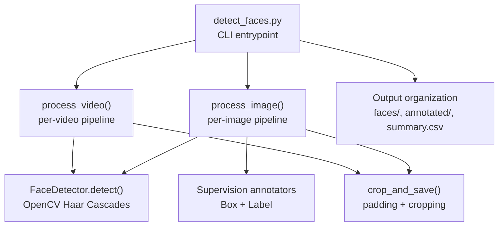
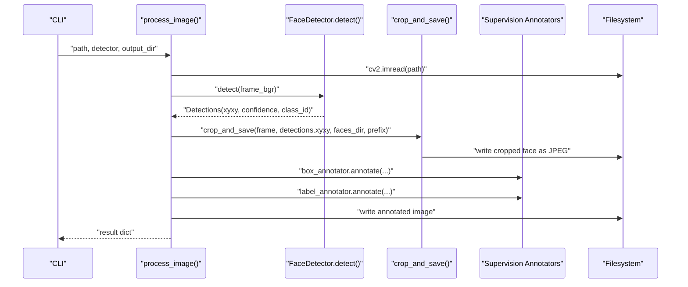
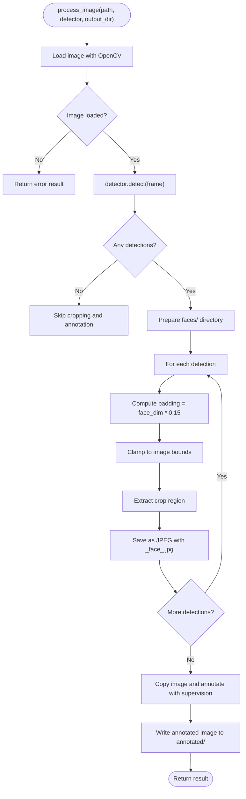
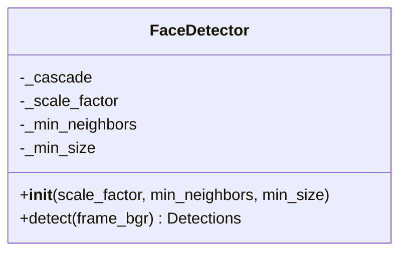
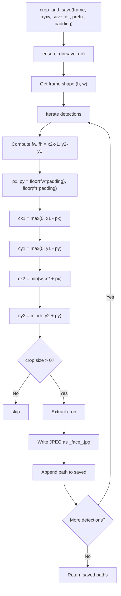
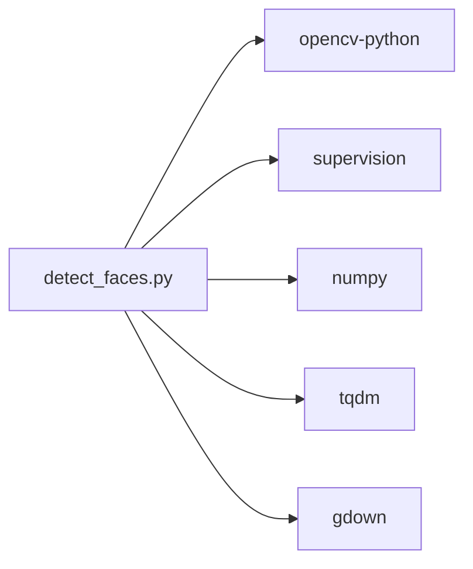

# Image Processing

<cite>
**Referenced Files in This Document**
- [detect_faces.py](file://detect_faces.py)
- [requirements.txt](file://requirements.txt)
- [.gitignore](file://.gitignore)
</cite>

## Table of Contents
1. [Introduction](#introduction)
2. [Project Structure](#project-structure)
3. [Core Components](#core-components)
4. [Architecture Overview](#architecture-overview)
5. [Detailed Component Analysis](#detailed-component-analysis)
6. [Dependency Analysis](#dependency-analysis)
7. [Performance Considerations](#performance-considerations)
8. [Troubleshooting Guide](#troubleshooting-guide)
9. [Conclusion](#conclusion)
10. [Appendices](#appendices)

## Introduction
This document explains the image processing workflow implemented in the repository, focusing on the process_image function and the broader face detection pipeline. It covers:
- Image loading with robust error handling
- Face detection using OpenCV Haar Cascades integrated with the supervision library
- Face cropping with configurable padding and safe boundary handling
- Annotation generation and saving of annotated images
- Output organization, filename conventions, and directory hierarchy
- Coordinate calculations, padding algorithms, and image quality preservation
- Examples of processing different image formats, handling edge cases, and optimizing memory usage for large images

## Project Structure
The repository centers around a single script that orchestrates face detection across images and videos, with support for downloading inputs from Google Drive. Key elements:
- detect_faces.py: Implements the face detection pipeline, image/video processing, output organization, and CLI argument parsing
- requirements.txt: Declares runtime dependencies (OpenCV, supervision, NumPy, tqdm, gdown)
- .gitignore: Ignores Python caches, logs, and output directories

**Diagram sources**
- [detect_faces.py](file://detect_faces.py)
- [requirements.txt](file://requirements.txt)

**Section sources**
- [detect_faces.py](file://detect_faces.py)
- [requirements.txt](file://requirements.txt)
- [.gitignore](file://.gitignore)

## Core Components
- FaceDetector: Wraps OpenCV’s Haar Cascade classifier, converts detections to supervision Detections, and exposes a detect method.
- process_image: Loads an image, runs detection, saves cropped faces under faces/<stem>, and writes an annotated image to annotated/.
- crop_and_save: Applies configurable padding to detection boxes, clamps coordinates to image bounds, extracts crops, and saves as JPEG.
- process_video: Iterates frames at a configurable sample rate, detects faces, and saves crops with a frame-indexed prefix.
- Output organization: Faces saved under faces/<original_filename_stem>/ with filenames like <prefix>_face_<index>.jpg; annotated images saved under annotated/<original_name>.

Key behaviors:
- Supported image formats include JPG/JPEG, PNG, BMP, WebP, TIFF/TIF.
- Supported video formats include MP4, AVI, MOV, MKV, WMV, FLV, WebM.
- Padding defaults to 15% of face width/height and is applied uniformly with boundary clamping.

**Section sources**
- [detect_faces.py](file://detect_faces.py)

## Architecture Overview
The system follows a modular pipeline:
- CLI resolves input (local folder or Google Drive)
- Initializes FaceDetector with configurable parameters
- Scans media files recursively
- Processes each file with either process_image or process_video
- Aggregates results and writes a summary CSV

**Diagram sources**
- [detect_faces.py](file://detect_faces.py)

## Detailed Component Analysis

### process_image: Image Loading, Detection, Cropping, and Annotation
Responsibilities:
- Load image using OpenCV
- Detect faces via FaceDetector
- Save cropped faces under faces/<original_filename_stem>/
- Save annotated image under annotated/<original_name>
- Return structured result for reporting

Error handling:
- If image cannot be read, returns an error result indicating failure to read.

Output organization:
- Cropped faces: faces/<original_filename_stem>/<prefix>_face_<index>.jpg
- Annotated image: annotated/<original_name>

Filename conventions:
- Prefix for images is the original filename stem
- Index is zero-padded to three digits

Coordinate handling:
- Uses supervision Detections.xyxy bounding boxes
- Converts to integer pixel coordinates and clamps to image bounds

Padding algorithm:
- Padding fraction defaults to 0.15
- For each face, computes horizontal and vertical padding as a fraction of face width/height
- Adjusts box coordinates by subtracting padding from top-left and adding padding to bottom-right
- Clamps new coordinates to [0, width) and [0, height) respectively

Quality preservation:
- Crops are saved as JPEG with default compression
- Original image is copied before annotation to preserve quality

Edge cases:
- Zero detections: skips cropping and annotation
- Empty crops after padding/clamping: skipped silently
- Non-existent input path: reported as error

**Diagram sources**
- [detect_faces.py](file://detect_faces.py)

**Section sources**
- [detect_faces.py](file://detect_faces.py)

### FaceDetector: OpenCV Haar Cascade Wrapper
Responsibilities:
- Initialize Haar Cascade classifier from OpenCV data
- Convert BGR frame to grayscale and equalize histogram
- Run detectMultiScale with configurable parameters
- Convert rectangles to supervision Detections

Parameters:
- scale_factor: affects image pyramid scaling
- min_neighbors: controls acceptance threshold
- min_size: minimum face size in pixels

Error handling:
- Raises a runtime error if cascade fails to load

**Diagram sources**
- [detect_faces.py](file://detect_faces.py)

**Section sources**
- [detect_faces.py](file://detect_faces.py)

### crop_and_save: Cropping with Configurable Padding
Responsibilities:
- Compute padding offsets from face dimensions
- Clamp padded coordinates to image boundaries
- Extract crops and write as JPEG
- Return list of saved paths

Padding algorithm:
- Horizontal padding = floor(face_width × padding_fraction)
- Vertical padding = floor(face_height × padding_fraction)
- New box = [x1 - px, y1 - py, x2 + px, y2 + py]
- Clamp to [0, width) and [0, height)

Filename convention:
- <prefix>_face_<index>.jpg with zero-padded index

**Diagram sources**
- [detect_faces.py](file://detect_faces.py)

**Section sources**
- [detect_faces.py](file://detect_faces.py)

### process_video: Frame Sampling and Batch Cropping
Responsibilities:
- Open video capture
- Sample frames at configured rate
- Detect faces per sampled frame
- Save crops with a frame-indexed prefix
- Aggregate totals and return results

Key behaviors:
- Sample rate determines how many frames are processed
- Cropped faces saved under faces/<video_stem>/ with prefix <video_stem>_f<frame_index>.jpg
- Annotated images are not saved for videos in this implementation

**Section sources**
- [detect_faces.py](file://detect_faces.py)

## Dependency Analysis
External libraries and their roles:
- OpenCV: Image loading, video capture, grayscale conversion, histogram equalization, Haar cascade inference
- supervision: Detection data model and annotation utilities (box and label annotators)
- NumPy: Array operations for detections and image arrays
- tqdm: Progress bars during processing
- gdown: Downloading shared Google Drive folders/files

**Diagram sources**
- [detect_faces.py](file://detect_faces.py)
- [requirements.txt](file://requirements.txt)

**Section sources**
- [detect_faces.py](file://detect_faces.py)
- [requirements.txt](file://requirements.txt)

## Performance Considerations
- Memory usage:
  - Images are loaded into memory as NumPy arrays; large images increase peak memory usage
  - Consider resizing or processing in tiles for extremely large images
- Detection parameters:
  - Larger min_size reduces false positives and speeds up detection
  - Higher min_neighbors increases acceptance threshold, reducing false positives
  - Smaller scale_factor improves recall but increases computation
- Video sampling:
  - Increase sample_rate to reduce processing time at the cost of temporal coverage
- I/O:
  - JPEG compression is lossy; quality depends on encoder defaults
  - Writing many small crops can be I/O bound; ensure adequate disk throughput

[No sources needed since this section provides general guidance]

## Troubleshooting Guide
Common issues and resolutions:
- Cannot read image:
  - Verify file path and permissions
  - Confirm file format is supported
  - Check for corrupted files
- Cannot open video:
  - Ensure video codec is available
  - Verify file integrity
- No faces detected:
  - Adjust min_neighbors and min_size
  - Try different scale_factor
  - Ensure sufficient lighting and face visibility
- Cropped faces missing:
  - Check padding fraction and face size
  - Verify detections.xyxy is populated
- Output directory not created:
  - Ensure write permissions in target location

**Section sources**
- [detect_faces.py](file://detect_faces.py)

## Conclusion
The image processing workflow provides a robust pipeline for detecting faces in images and videos, cropping faces with configurable padding, and annotating images for visualization. The modular design enables easy tuning of detection parameters and efficient batch processing. Proper error handling and output organization facilitate reliable operation across diverse inputs.

[No sources needed since this section summarizes without analyzing specific files]

## Appendices

### Output Organization and Filename Conventions
- Directory hierarchy:
  - faces/<original_filename_stem>/ for cropped faces
  - annotated/ for annotated images
- Filename conventions:
  - Images: <prefix>_face_<index>.jpg (zero-padded index)
  - Annotated images: original filename preserved
- Summary report:
  - summary.csv with fields: file, type, faces, saved_faces, error

**Section sources**
- [detect_faces.py](file://detect_faces.py)

### Supported Formats and Extensions
- Images: JPG/JPEG, PNG, BMP, WebP, TIFF/TIF
- Videos: MP4, AVI, MOV, MKV, WMV, FLV, WebM

**Section sources**
- [detect_faces.py](file://detect_faces.py)

### Example Workflows
- Process a local folder:
  - Run the script with --input pointing to the folder
- Process a Google Drive folder:
  - Pass --google-drive with a shared folder URL or ID; files are downloaded to a temporary location and processed
- Optimize detection:
  - Tune --scale-factor, --min-neighbors, and --min-size to balance speed and accuracy

**Section sources**
- [detect_faces.py](file://detect_faces.py)