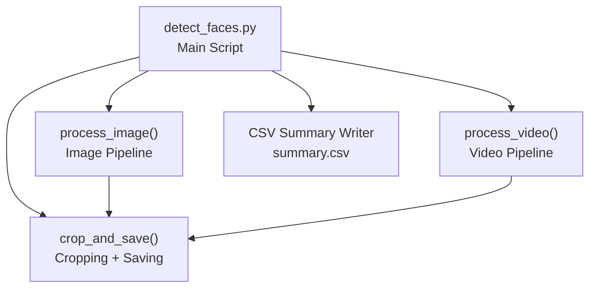
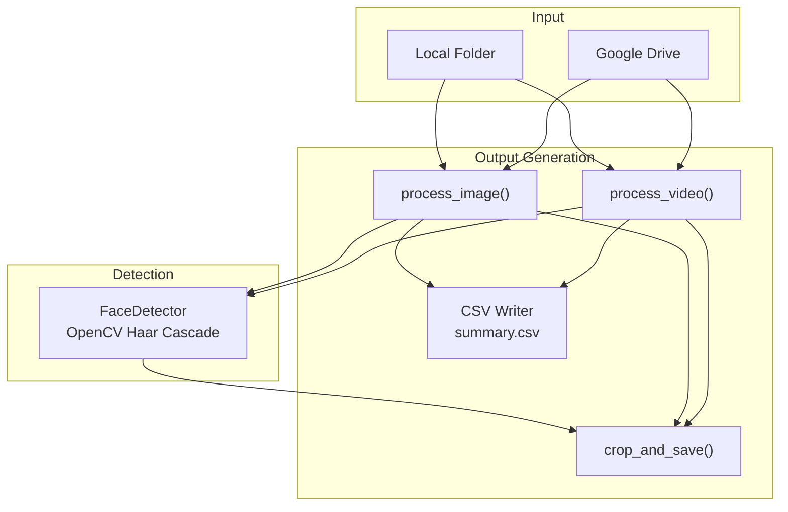
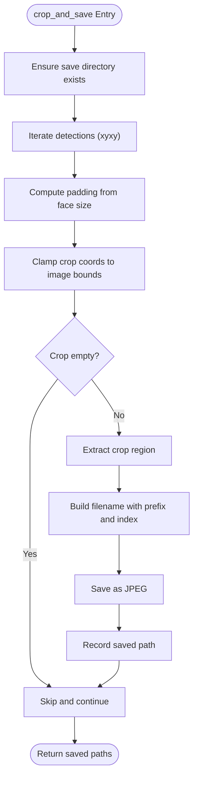
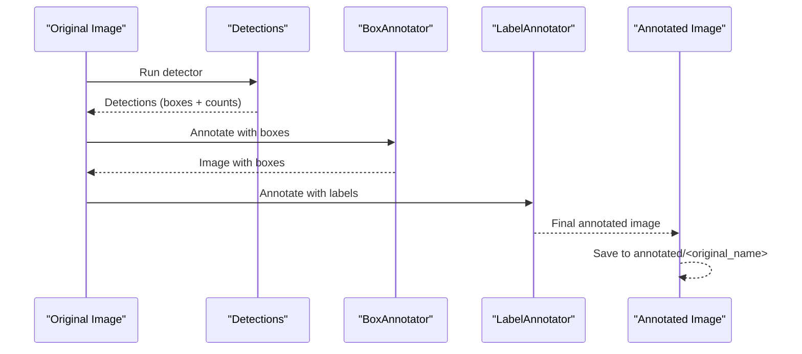
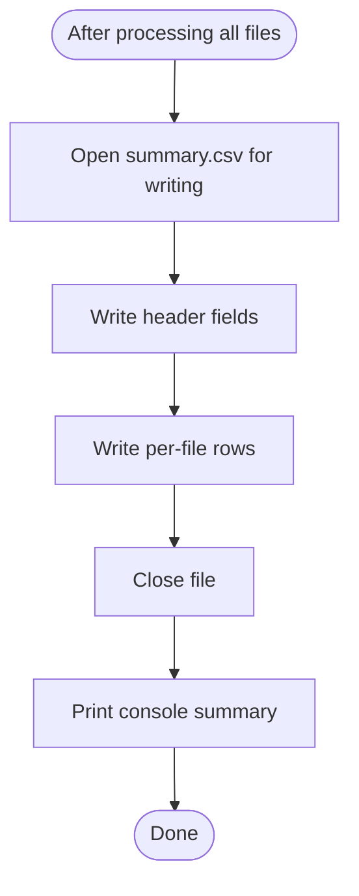
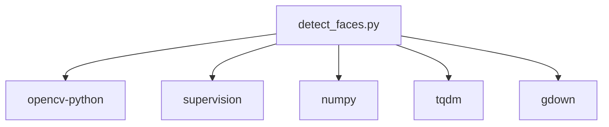

# Output Generation

<cite>
**Referenced Files in This Document**
- [detect_faces.py](file://detect_faces.py)
- [requirements.txt](file://requirements.txt)
</cite>

## Table of Contents
1. [Introduction](#introduction)
2. [Project Structure](#project-structure)
3. [Core Components](#core-components)
4. [Architecture Overview](#architecture-overview)
5. [Detailed Component Analysis](#detailed-component-analysis)
6. [Dependency Analysis](#dependency-analysis)
7. [Performance Considerations](#performance-considerations)
8. [Troubleshooting Guide](#troubleshooting-guide)
9. [Conclusion](#conclusion)
10. [Appendices](#appendices)

## Introduction
This document explains the output generation system implemented in the face detection pipeline. It covers:
- Face cropping with padding and boundary handling
- Annotation creation using the supervision library for visual face detections
- CSV summary generation with field definitions and statistics
- Output directory structure and filename conventions
- Error handling for failed operations
- Best practices for organizing large-scale processing results

## Project Structure
The repository contains a single script implementing the entire pipeline and a requirements file declaring dependencies. The output generation system centers around three primary functions:
- crop_and_save: performs face cropping with padding and writes images
- process_image: orchestrates detection, cropping, and annotation for images
- process_video: orchestrates detection, cropping, and annotation for videos
- CSV summary writing and printing of aggregated statistics

**Diagram sources**
- [detect_faces.py](file://detect_faces.py)

**Section sources**
- [detect_faces.py](file://detect_faces.py)

## Core Components
- crop_and_save: Applies padding to bounding boxes, clamps coordinates to image boundaries, extracts crops, and saves them as JPEG images.
- process_image: Loads an image, runs detection, saves cropped faces under a per-file directory, annotates the original image with boxes and labels, and records counts.
- process_video: Iterates frames at a configurable sample rate, detects faces, saves cropped faces with frame-indexed prefixes, annotates representative frames, and aggregates totals.
- CSV summary: Writes a structured summary report with standardized fields and prints a human-readable summary.

**Section sources**
- [detect_faces.py](file://detect_faces.py)

## Architecture Overview
The output generation architecture follows a modular design:
- Input resolution: Local folder or Google Drive download
- Detection: OpenCV Haar cascades wrapped in a detector class
- Cropping: Per-detection bounding box with padding and boundary clamping
- Annotation: Supervision’s BoxAnnotator and LabelAnnotator overlays
- Reporting: CSV summary and console summary

**Diagram sources**
- [detect_faces.py](file://detect_faces.py)

## Detailed Component Analysis

### crop_and_save Function
Purpose:
- Crop detected faces from frames and save them as individual images.

Key behaviors:
- Padding calculation: Uses a fractional padding relative to the face width and height.
- Boundary handling: Clamps crop coordinates to image dimensions and ensures non-empty crops.
- Filename convention: Prefixes each crop with a base identifier and a zero-padded index; saves as JPEG.
- Output directory: Ensures the target directory exists before saving.

Implementation highlights:
- Padding computation scales with face size to maintain proportional margins.
- Coordinate clamping prevents out-of-bounds indexing.
- Empty crops are skipped to avoid errors during saving.
- Saved paths are collected and returned for downstream accounting.

**Diagram sources**
- [detect_faces.py](file://detect_faces.py)

**Section sources**
- [detect_faces.py](file://detect_faces.py)

### Annotation Pipeline with supervision
Purpose:
- Overlay bounding boxes and labels on detected faces for visual verification.

Key behaviors:
- Box overlay: Uses BoxAnnotator with indexed color lookup for distinct colors per detection.
- Label overlay: Uses LabelAnnotator with labels formatted as “face 1”, “face 2”, etc.
- Output: Saves annotated images to an “annotated” subdirectory with the original filename.

**Diagram sources**
- [detect_faces.py](file://detect_faces.py)

**Section sources**
- [detect_faces.py](file://detect_faces.py)

### CSV Summary Generation
Purpose:
- Produce a machine-readable summary of per-file results and aggregate statistics.

Fields:
- file: Basename of the input file
- type: Either image or video
- faces: Total number of faces detected
- saved_faces: Number of face crops saved
- error: Optional error message if processing failed

Writing and formatting:
- UTF-8 encoding with platform-appropriate newlines
- Header row followed by rows for each processed file
- Extra fields beyond the defined set are ignored

Aggregation and reporting:
- Console summary prints totals for processed files, faces found, and saved crops
- Paths to the output directory and summary CSV are shown

**Diagram sources**
- [detect_faces.py](file://detect_faces.py)

**Section sources**
- [detect_faces.py](file://detect_faces.py)

### Output Directory Structure and Filename Conventions
Structure:
- output/
  - faces/
    - <image_stem>/ (for images)
      - <prefix>_face_<index>.jpg
    - <video_stem>/ (for videos)
      - <prefix>_face_<index>.jpg
  - annotated/
    - <original_image_name>
    - <representative_frame_name_for_video>

Filename conventions:
- Images: <prefix> is the image basename; index is zero-padded to three digits.
- Videos: <prefix> combines the video basename with a zero-padded frame index; crops saved per sampled frame.

Saving formats:
- Cropped faces: JPEG
- Annotated images: Original image extension preserved

**Section sources**
- [detect_faces.py](file://detect_faces.py)

## Dependency Analysis
External libraries:
- OpenCV: Image loading, grayscale conversion, histogram equalization, Haar cascade detection, and image writing
- supervision: Detection data structures and annotation utilities (BoxAnnotator, LabelAnnotator)
- NumPy: Array operations for detections and image arrays
- tqdm: Progress bars for video processing
- gdown: Downloading Google Drive folders/files into a temporary location

**Diagram sources**
- [detect_faces.py](file://detect_faces.py)
- [requirements.txt](file://requirements.txt)

**Section sources**
- [detect_faces.py](file://detect_faces.py)
- [requirements.txt](file://requirements.txt)

## Performance Considerations
- Video sampling: Process every N-th frame to reduce computational load; tune the sample rate for speed vs. coverage trade-offs.
- Cropping overhead: Limit unnecessary saves by skipping empty crops and ensuring padding does not exceed image bounds.
- I/O efficiency: Batch writes to CSV and avoid redundant directory checks by using ensure_dir once per path.
- Memory: Keep detection results minimal; only store necessary metadata for CSV and console summaries.

## Troubleshooting Guide
Common failure modes and handling:
- Cannot read image: process_image returns an error record; verify file integrity and permissions.
- Cannot open video: process_video returns an error record; verify codec support and file accessibility.
- Empty detections: No crops saved; adjust detector parameters (scale factor, min neighbors, min size) to improve sensitivity.
- Out-of-bounds crops: crop_and_save skips empty crops; ensure detection coordinates are valid and padding is reasonable.
- Missing input directory: Program exits with an error after printing guidance; confirm the path exists and is accessible.
- Google Drive download failures: Temporary folder cleanup occurs automatically; retry with a valid shared URL or ID.

Best practices:
- Validate detector parameters for your dataset to minimize false positives/negatives.
- Monitor progress bars for videos to estimate runtime and adjust sample rates accordingly.
- Store outputs in dedicated directories per project to simplify post-processing and archival.
- Use the CSV summary for quick audits and automated reporting pipelines.

**Section sources**
- [detect_faces.py](file://detect_faces.py)

## Conclusion
The output generation system integrates face cropping, visual annotation, and CSV reporting into a cohesive pipeline. It emphasizes robustness through boundary checks, clear directory conventions, and structured logging. By tuning detector parameters and sampling rates, users can scale the system effectively for large datasets while maintaining reproducible and interpretable results.

## Appendices

### Field Definitions for CSV Summary
- file: Name of the input file
- type: image or video
- faces: Total number of faces detected across the file
- saved_faces: Number of face crops saved
- error: Optional error encountered during processing

**Section sources**
- [detect_faces.py](file://detect_faces.py)