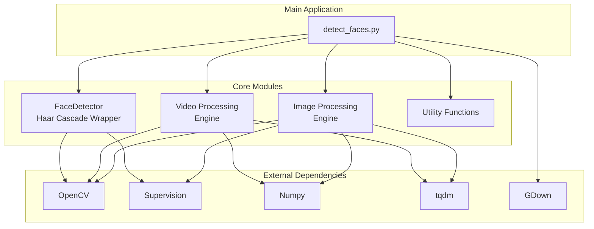
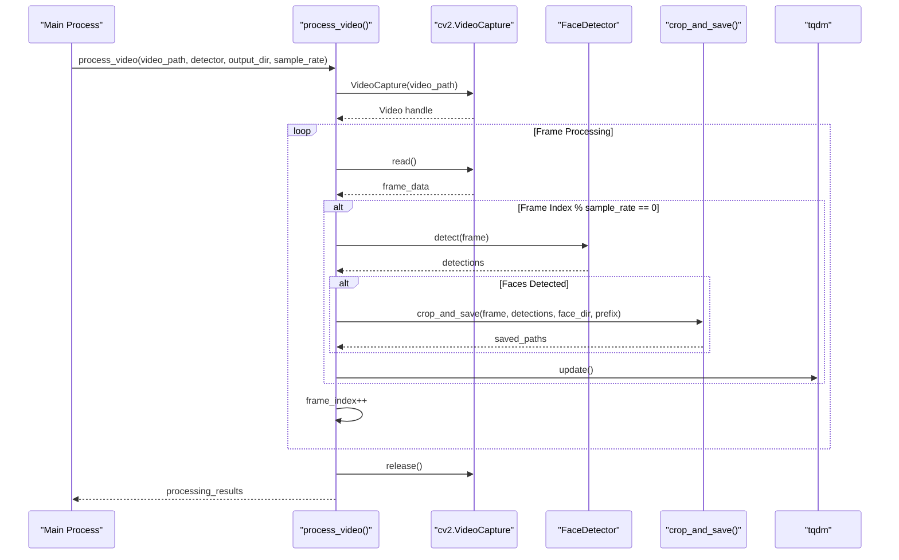
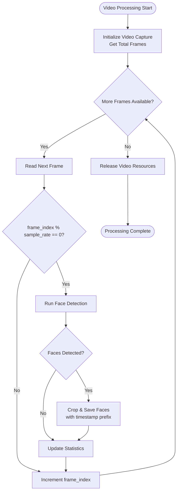
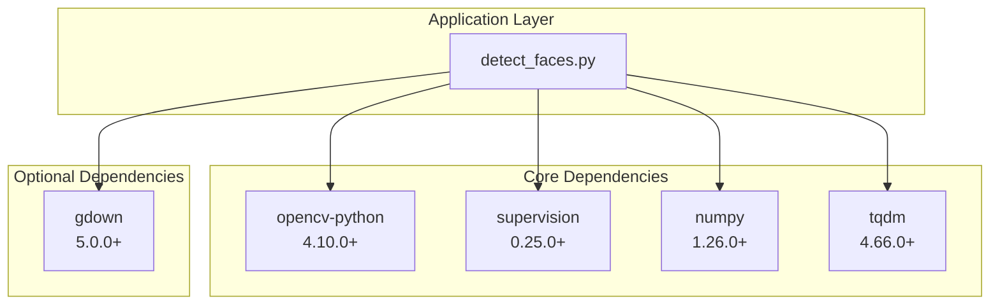

# Video Processing

<cite>
**Referenced Files in This Document**
- [detect_faces.py](file://detect_faces.py)
- [requirements.txt](file://requirements.txt)
</cite>

## Table of Contents
1. [Introduction](#introduction)
2. [Project Structure](#project-structure)
3. [Core Components](#core-components)
4. [Architecture Overview](#architecture-overview)
5. [Detailed Component Analysis](#detailed-component-analysis)
6. [Dependency Analysis](#dependency-analysis)
7. [Performance Considerations](#performance-considerations)
8. [Troubleshooting Guide](#troubleshooting-guide)
9. [Conclusion](#conclusion)

## Introduction
This document provides comprehensive technical documentation for the video processing system implemented in the face detection pipeline. The system focuses on efficient video face detection using OpenCV Haar cascades with configurable frame sampling strategies for performance optimization. The primary implementation centers around the `process_video` function, which handles video capture setup, frame sampling, face detection, and output management.

The video processing system is designed to handle various video formats (MP4, AVI, MOV, MKV, WMV, FLV, WebM) while maintaining performance through intelligent frame sampling. It integrates with the broader face detection framework that also supports image processing and provides comprehensive reporting capabilities.

## Project Structure
The project follows a modular architecture with clear separation between video processing, image processing, and utility functions:

**Diagram sources**
- [detect_faces.py:99-137](file://detect_faces.py#L99-L137)
- [detect_faces.py:227-286](file://detect_faces.py#L227-L286)
- [detect_faces.py:185-223](file://detect_faces.py#L185-L223)

**Section sources**
- [detect_faces.py:1-447](file://detect_faces.py#L1-L447)
- [requirements.txt:1-6](file://requirements.txt#L1-L6)

## Core Components

### Video Processing Engine
The video processing engine is built around the `process_video` function, which serves as the central orchestrator for video face detection operations. This function implements sophisticated frame sampling strategies and memory-efficient processing techniques.

Key characteristics:
- **Frame Sampling**: Processes every N-th frame based on the `sample_rate` parameter
- **Memory Management**: Releases video resources after processing completion
- **Progress Tracking**: Integrates with tqdm for real-time progress monitoring
- **Output Organization**: Creates structured output directories for face crops

### Face Detection Integration
The video processing seamlessly integrates with the FaceDetector class, which wraps OpenCV's Haar cascade implementation. This integration ensures consistent face detection quality across both image and video processing modes.

### Output Management System
The system implements a hierarchical output structure:
- Root output directory
- Subdirectory for face crops organized by video file
- Individual face crop images with timestamp-based naming
- Annotated frames for verification and debugging

**Section sources**
- [detect_faces.py:227-286](file://detect_faces.py#L227-L286)
- [detect_faces.py:99-137](file://detect_faces.py#L99-L137)
- [detect_faces.py:152-181](file://detect_faces.py#L152-L181)

## Architecture Overview

The video processing architecture follows a pipeline-based design that optimizes for both performance and resource efficiency:

**Diagram sources**
- [detect_faces.py:227-286](file://detect_faces.py#L227-L286)
- [detect_faces.py:257-275](file://detect_faces.py#L257-L275)
- [detect_faces.py:112-136](file://detect_faces.py#L112-L136)

## Detailed Component Analysis

### process_video Function Implementation

The `process_video` function implements a sophisticated frame processing pipeline with several key optimization strategies:

#### Video Capture Setup
The function initializes video capture using OpenCV's VideoCapture interface, establishing connection to the video file and retrieving essential video properties. The implementation includes robust error handling for video loading failures.

#### Frame Sampling Strategy
The core performance optimization lies in the frame sampling mechanism controlled by the `sample_rate` parameter:

**Diagram sources**
- [detect_faces.py:257-275](file://detect_faces.py#L257-L275)
- [detect_faces.py:262-270](file://detect_faces.py#L262-L270)

#### Memory Management for Long Videos
The implementation employs several memory management strategies:
- **Resource Cleanup**: Explicit video capture release prevents memory leaks
- **Frame-by-Frame Processing**: Processes frames individually without storing entire video in memory
- **Progressive Output**: Writes face crops incrementally during processing
- **Temporary Directory Management**: Handles temporary Google Drive downloads efficiently

#### Progress Tracking Integration
The system integrates tqdm for comprehensive progress monitoring:
- **Total Frame Calculation**: Uses `CAP_PROP_FRAME_COUNT` for accurate progress estimation
- **Dynamic Updates**: Updates progress bar for each processed frame
- **Descriptive Labels**: Provides clear file-specific progress indicators

**Section sources**
- [detect_faces.py:227-286](file://detect_faces.py#L227-L286)
- [detect_faces.py:250-278](file://detect_faces.py#L250-L278)

### Frame-by-Frame Processing Pipeline

The frame processing pipeline follows a systematic approach to ensure efficient and reliable face detection:

#### Frame Indexing and Timestamp Handling
The system maintains precise frame indexing throughout processing:
- **Sequential Counting**: Increments `frame_index` for each read frame
- **Timestamp-Based Naming**: Uses zero-padded frame indices in output filenames
- **Consistent Prefix Generation**: Creates unique prefixes combining video name and frame index

#### Video Property Extraction
The implementation extracts essential video properties for processing:
- **Total Frame Count**: Uses `cv2.CAP_PROP_FRAME_COUNT` for progress calculation
- **Frame Rate Information**: Accessible through OpenCV properties for timing calculations
- **Resolution Data**: Available for coordinate transformations and scaling

#### Output Naming Conventions
Face crop output follows a structured naming convention:
- **Prefix Pattern**: `{video_name}_f{frame_index:06d}_face_{crop_index:03d}.jpg`
- **Hierarchical Organization**: Face crops stored in `output/faces/{video_name}/` directory
- **Zero-Padding**: Ensures proper chronological sorting of output files

**Section sources**
- [detect_faces.py:241](file://detect_faces.py#L241)
- [detect_faces.py:268](file://detect_faces.py#L268)
- [detect_faces.py:176](file://detect_faces.py#L176)

### Face Detection Integration

The video processing seamlessly integrates with the FaceDetector class:

#### Haar Cascade Configuration
The detector uses OpenCV's built-in Haar cascade classifier with configurable parameters:
- **Scale Factor**: Controls image pyramid scaling (default: 1.1)
- **Min Neighbors**: Determines detection quality threshold (default: 5)
- **Min Size**: Sets minimum face detection size (default: 30x30 pixels)

#### Detection Pipeline
Each frame undergoes a standardized detection process:
- **Grayscale Conversion**: Converts BGR frames to grayscale for detection
- **Histogram Equalization**: Improves detection accuracy under varying lighting
- **Multi-Scale Detection**: Searches for faces at multiple scales
- **Detections Aggregation**: Returns structured detection results

**Section sources**
- [detect_faces.py:99-137](file://detect_faces.py#L99-L137)
- [detect_faces.py:112-136](file://detect_faces.py#L112-L136)

## Dependency Analysis

The video processing system relies on several key dependencies that enable its functionality:

**Diagram sources**
- [requirements.txt:1-6](file://requirements.txt#L1-L6)
- [detect_faces.py:28-32](file://detect_faces.py#L28-L32)

### External Library Integration

#### OpenCV Integration
The system leverages OpenCV for:
- **Video Capture**: Reading video frames and properties
- **Image Processing**: Grayscale conversion and histogram equalization
- **Face Detection**: Haar cascade implementation
- **Image I/O**: Writing cropped face images

#### Supervision Integration
Supervision library provides:
- **Detection Data Structures**: Structured face detection results
- **Annotation Utilities**: Visual annotation capabilities
- **Color Management**: Consistent color schemes for annotations

#### NumPy Integration
NumPy enables:
- **Array Operations**: Efficient numerical computations
- **Image Manipulation**: Fast array-based image processing
- **Data Structures**: Optimized storage for detection coordinates

**Section sources**
- [requirements.txt:1-6](file://requirements.txt#L1-L6)
- [detect_faces.py:28-32](file://detect_faces.py#L28-L32)

## Performance Considerations

### Optimal Sample Rate Configuration

The `sample_rate` parameter controls the balance between processing speed and detection completeness:

#### Quality vs. Performance Trade-offs
- **High Sample Rates (1-3)**: Maximum detection accuracy, slower processing
- **Medium Sample Rates (4-8)**: Good balance for most applications
- **Low Sample Rates (9+)**: Fastest processing, potential missed detections

#### Video Quality Recommendations
- **High Resolution (1080p+)**: Use sample rates 3-5 for optimal balance
- **Standard Definition (720p)**: Sample rate 2-4 recommended
- **Low Resolution (<480p)**: Sample rate 1-3 sufficient
- **Fast Motion Content**: Consider higher sample rates (2-3)
- **Slow Motion Content**: Lower sample rates (4-8) acceptable

### Memory Optimization Strategies

#### Resource Management
- **Immediate Release**: Video captures are released after processing
- **Progressive Processing**: No accumulation of frames in memory
- **Efficient Cropping**: Direct cropping without intermediate copies

#### Processing Pipeline Optimization
- **Early Termination**: Stops processing on video errors
- **Selective Detection**: Only processes sampled frames
- **Minimal Data Storage**: Stores only detection results and metadata

### Performance Monitoring

The system provides comprehensive performance metrics:
- **Frame Processing Count**: Tracks processed frames vs. total frames
- **Face Detection Statistics**: Counts total faces and successful crops
- **Processing Time Estimation**: Uses frame count and sample rate for timing

**Section sources**
- [detect_faces.py:340-345](file://detect_faces.py#L340-L345)
- [detect_faces.py:250-255](file://detect_faces.py#L250-L255)

## Troubleshooting Guide

### Common Video Loading Issues

#### Video File Access Problems
**Symptoms**: Processing returns "cannot open video" error
**Causes**: Corrupted video files, unsupported codecs, file permissions
**Solutions**:
- Verify video file integrity using media player
- Check codec support and convert if necessary
- Ensure read permissions for video files
- Test with different video players to confirm format compatibility

#### Frame Count Retrieval Failures
**Symptoms**: Progress bar shows incorrect estimates or fails to update
**Causes**: Inaccurate frame count metadata, corrupted video headers
**Solutions**:
- Use alternative video processing libraries for problematic files
- Re-encode videos to ensure proper metadata
- Implement fallback progress tracking without frame count

#### Memory Issues with Large Videos
**Symptoms**: Out of memory errors or excessive RAM usage
**Solutions**:
- Reduce sample rate to decrease processing load
- Process videos in smaller segments
- Monitor system memory during processing
- Consider batch processing with multiple runs

### Detection Accuracy Issues

#### Low Detection Rates
**Symptoms**: Few or no faces detected in videos
**Causes**: Inappropriate sample rate, poor lighting conditions, small faces
**Solutions**:
- Increase sample rate for better coverage
- Adjust FaceDetector parameters (scale_factor, min_neighbors)
- Improve video lighting conditions
- Consider alternative detection models for challenging scenarios

#### False Positive Detection
**Symptoms**: Non-face objects identified as faces
**Solutions**:
- Increase min_neighbors parameter
- Adjust min_size threshold
- Use higher quality video sources
- Implement post-processing filtering

### Output and Storage Issues

#### Missing Face Crops
**Symptoms**: No face crop files generated despite detections
**Causes**: Permission issues, disk space problems, crop area validation failures
**Solutions**:
- Verify write permissions for output directories
- Check available disk space
- Review crop area calculations for edge cases
- Validate output directory creation

#### Progress Bar Malfunctions
**Symptoms**: Progress bar not updating or showing incorrect estimates
**Solutions**:
- Verify tqdm installation and version compatibility
- Check terminal support for progress display
- Disable progress bar with `--no-progress` flag if needed
- Monitor processing logs for detailed status information

**Section sources**
- [detect_faces.py:238](file://detect_faces.py#L238)
- [detect_faces.py:267-270](file://detect_faces.py#L267-L270)
- [detect_faces.py:173](file://detect_faces.py#L173)

## Conclusion

The video processing system demonstrates a well-architected approach to efficient face detection in video content. The `process_video` function successfully balances performance optimization with detection accuracy through intelligent frame sampling strategies and robust error handling mechanisms.

Key strengths of the implementation include:
- **Configurable Sampling**: Flexible frame processing through the `sample_rate` parameter
- **Memory Efficiency**: Resource-conscious design prevents memory leaks and excessive resource usage
- **Progress Monitoring**: Comprehensive progress tracking enhances user experience
- **Structured Output**: Organized file naming and directory structure facilitate downstream processing
- **Robust Error Handling**: Comprehensive error detection and graceful degradation

The system provides a solid foundation for video-based face detection tasks while offering clear extension points for advanced features such as multi-threaded processing, GPU acceleration, or integration with more sophisticated detection models. The modular design ensures maintainability and adaptability to evolving requirements in video processing applications.