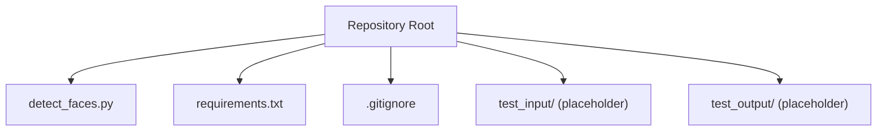
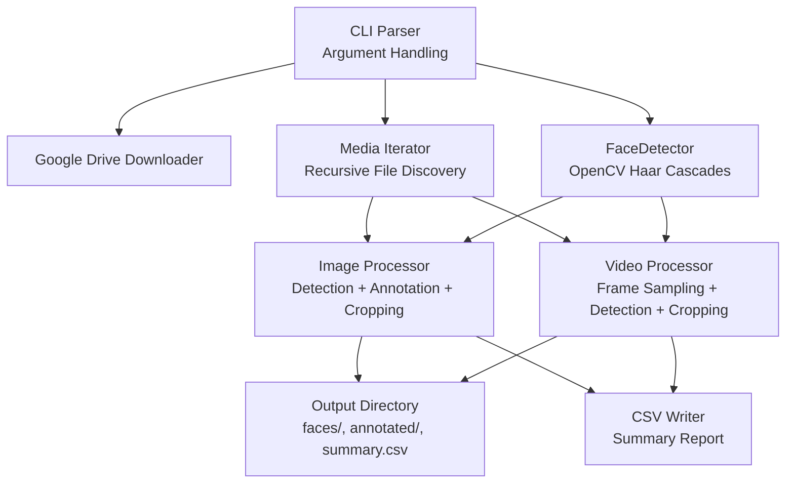
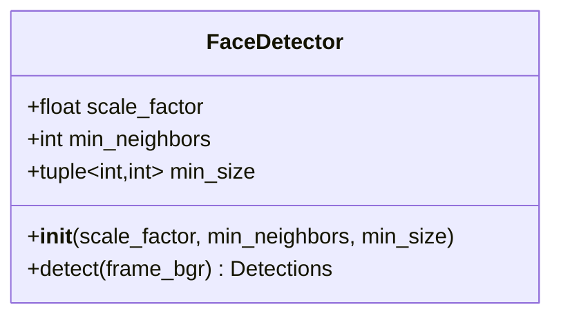
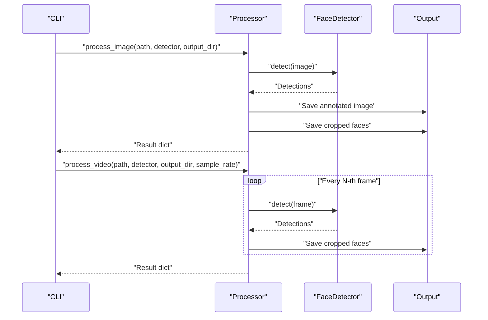
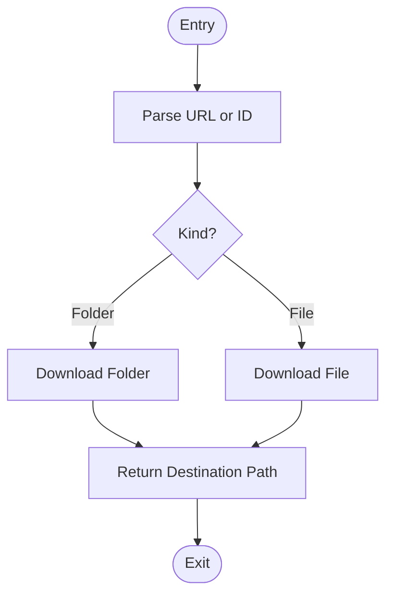
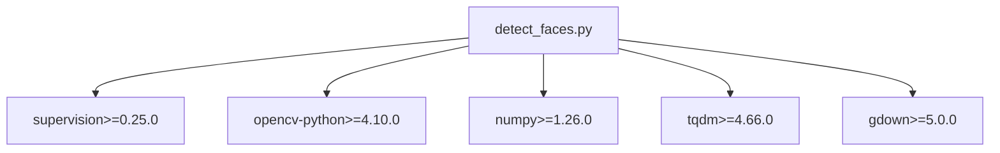

# Development and Contributing

<cite>
**Referenced Files in This Document**
- [detect_faces.py](file://detect_faces.py)
- [requirements.txt](file://requirements.txt)
- [.gitignore](file://.gitignore)
</cite>

## Table of Contents
1. [Introduction](#introduction)
2. [Project Structure](#project-structure)
3. [Core Components](#core-components)
4. [Architecture Overview](#architecture-overview)
5. [Detailed Component Analysis](#detailed-component-analysis)
6. [Dependency Analysis](#dependency-analysis)
7. [Development Environment Setup](#development-environment-setup)
8. [Testing Procedures](#testing-procedures)
9. [Coding Standards](#coding-standards)
10. [Debugging Approaches](#debugging-approaches)
11. [Extension Points](#extension-points)
12. [Version Management and Release Processes](#version-management-and-release-processes)
13. [Contribution Workflow](#contribution-workflow)
14. [Troubleshooting Guide](#troubleshooting-guide)
15. [Conclusion](#conclusion)

## Introduction
CaptureFace is a Python-based tool designed to detect faces in batches of photos and videos, save cropped face images, and produce a summary report. It supports local folders and Google Drive shared links, integrates OpenCV Haar Cascades for detection, and uses Supervision for visualization and annotation. The project emphasizes simplicity, reproducibility, and ease of use for face detection tasks.

## Project Structure
The repository follows a minimal layout focused on a single-purpose script with straightforward dependencies and output handling.

**Diagram sources**
- [detect_faces.py](file://detect_faces.py)
- [requirements.txt](file://requirements.txt)
- [.gitignore](file://.gitignore)

**Section sources**
- [detect_faces.py](file://detect_faces.py)
- [requirements.txt](file://requirements.txt)
- [.gitignore](file://.gitignore)

## Core Components
- FaceDetector: Wraps OpenCV Haar Cascades to detect faces in BGR frames. It exposes configurable parameters for scale factor, minimum neighbors, and minimum face size.
- Media processing pipeline: Iterates through supported image and video files, detects faces, annotates images, and saves cropped face images.
- Google Drive integration: Downloads shared folders or files to a temporary location for processing.
- CLI interface: Provides command-line arguments for input selection, output directory, detector parameters, and video sampling rate.

Key responsibilities:
- Input resolution: Supports local paths or Google Drive URLs/IDs.
- Detection: Uses OpenCV Haar Cascades with configurable thresholds.
- Output: Saves annotated images and cropped faces, writes a CSV summary.

**Section sources**
- [detect_faces.py](file://detect_faces.py)

## Architecture Overview
The application is structured around a single entry point that orchestrates:
- Argument parsing
- Input source resolution (local or Google Drive)
- Initialization of the FaceDetector
- Iteration over media files
- Per-file processing (image vs video)
- Aggregation and reporting

**Diagram sources**
- [detect_faces.py](file://detect_faces.py)

## Detailed Component Analysis

### FaceDetector
The FaceDetector encapsulates OpenCV Haar Cascade usage with configurable parameters. It converts frames to grayscale, equalizes histograms, and runs detection to produce Supervision Detections.

**Diagram sources**
- [detect_faces.py](file://detect_faces.py)

**Section sources**
- [detect_faces.py](file://detect_faces.py)

### Media Processing Pipeline
The pipeline handles two distinct paths:
- Image processing: Loads the image, detects faces, annotates with boxes and labels, saves annotated image, and crops faces.
- Video processing: Samples frames at a configurable rate, detects faces per sampled frame, and saves cropped faces grouped by video.

**Diagram sources**
- [detect_faces.py](file://detect_faces.py)

**Section sources**
- [detect_faces.py](file://detect_faces.py)

### Google Drive Integration
The downloader extracts IDs from URLs or accepts raw IDs, supports both folders and single files, and returns the destination path for processing.

**Diagram sources**
- [detect_faces.py](file://detect_faces.py)

**Section sources**
- [detect_faces.py](file://detect_faces.py)

## Dependency Analysis
External dependencies are declared in requirements.txt and used throughout the script.

**Diagram sources**
- [detect_faces.py](file://detect_faces.py)
- [requirements.txt](file://requirements.txt)

**Section sources**
- [detect_faces.py](file://detect_faces.py)
- [requirements.txt](file://requirements.txt)

## Development Environment Setup
Prerequisites:
- Python interpreter compatible with the specified dependency versions.
- Virtual environment recommended to isolate dependencies.

Steps:
1. Create and activate a virtual environment.
2. Install dependencies from requirements.txt.
3. Verify OpenCV and Haar Cascade resources are available.
4. Confirm Supervision installation for visualization utilities.
5. Optionally install gdown for Google Drive support.

Verification:
- Run the script with minimal arguments to ensure basic functionality.
- Check that output directories are created and populated.

**Section sources**
- [requirements.txt](file://requirements.txt)
- [detect_faces.py](file://detect_faces.py)

## Testing Procedures
Current repository structure indicates placeholder directories for test inputs and outputs. Recommended approach:
- Prepare a small set of test images and videos in a local folder.
- Use the CLI to process the folder and verify:
  - Annotated images are produced.
  - Cropped face images are saved under the faces subdirectory.
  - summary.csv contains expected rows and columns.
- Validate edge cases:
  - Empty input folder.
  - Unsupported file types.
  - Corrupted media files.
- For Google Drive integration:
  - Use a small shared folder or file link.
  - Confirm temporary download and cleanup behavior.

Note: The repository does not include automated tests. Manual verification is advised until unit tests are introduced.

**Section sources**
- [detect_faces.py](file://detect_faces.py)

## Coding Standards
Guidelines derived from the existing codebase:
- Type hints: Use annotations for function signatures and return types.
- Imports: Group standard library, third-party, and local imports; order alphabetically within groups.
- Constants: Define global constants for file extensions and configuration defaults.
- Functions: Keep functions focused and single-responsibility; extract helpers for repeated logic.
- Logging: Use print statements for progress and errors; consider structured logging for future enhancements.
- Docstrings: Provide module-level and function-level documentation aligned with the existing style.
- Naming: Use descriptive names for variables and functions; prefer snake_case for identifiers.
- Error handling: Validate inputs early and fail fast with clear messages.

**Section sources**
- [detect_faces.py](file://detect_faces.py)

## Debugging Approaches
Common scenarios and strategies:
- OpenCV initialization failures:
  - Verify OpenCV installation and availability of Haar Cascade resources.
  - Check that the cascade path resolves correctly.
- Google Drive download issues:
  - Validate URL or ID format and network connectivity.
  - Confirm permissions for shared content.
- Performance bottlenecks:
  - Adjust sample_rate for videos to reduce processing time.
  - Tune detector parameters (scale_factor, min_neighbors, min_size).
- Output discrepancies:
  - Inspect output directory structure and CSV contents.
  - Validate that cropped faces meet expected dimensions.

**Section sources**
- [detect_faces.py](file://detect_faces.py)

## Extension Points
Potential areas to enhance the codebase:
- Replace Haar Cascades with modern deep learning detectors (e.g., YOLO, MTCNN) for improved accuracy.
- Add batch processing options and resume capabilities.
- Introduce configuration files for detector parameters and output preferences.
- Implement unit tests and CI pipelines for quality assurance.
- Support additional annotation formats and export options.
- Add metrics collection and visualization dashboards.

These extensions can be integrated while maintaining backward compatibility and preserving the existing CLI interface.

**Section sources**
- [detect_faces.py](file://detect_faces.py)

## Version Management and Release Processes
Repository state:
- No explicit version metadata or changelog is present.
- No package configuration (setup.py/pyproject.toml) is included.

Recommended practices:
- Adopt semantic versioning for releases.
- Maintain a changelog documenting breaking changes, features, and fixes.
- Tag releases in Git and publish artifacts as needed.
- Automate dependency updates and security checks.

[No sources needed since this section provides general guidance]

## Contribution Workflow
Proposed workflow:
1. Fork and branch:
   - Create a feature branch from the latest main branch.
2. Develop:
   - Follow coding standards and add tests where applicable.
3. Document:
   - Update inline documentation and README if necessary.
4. Test:
   - Verify functionality locally and document test results.
5. Submit PR:
   - Open a pull request with a clear description and rationale.
6. Review and iterate:
   - Address feedback and update the PR accordingly.
7. Merge:
   - Once approved, merge and close the PR.

[No sources needed since this section provides general guidance]

## Troubleshooting Guide
Common issues and resolutions:
- Cannot read image/video:
  - Ensure file paths are correct and accessible.
  - Verify file integrity and supported formats.
- Cannot initialize detector:
  - Confirm OpenCV installation and cascade resource availability.
- Google Drive download fails:
  - Check URL/ID validity and network connectivity.
  - Validate shared link permissions.
- Output not generated:
  - Confirm write permissions for the output directory.
  - Review CSV and image saving logic.

**Section sources**
- [detect_faces.py](file://detect_faces.py)

## Conclusion
CaptureFace provides a practical foundation for batch face detection with straightforward integration of OpenCV and Supervision. By following the development and contribution guidelines outlined here, contributors can extend functionality, improve reliability, and maintain consistency with the existing architecture. Future enhancements should focus on modernizing detection models, adding robustness, and establishing automated testing and release processes.