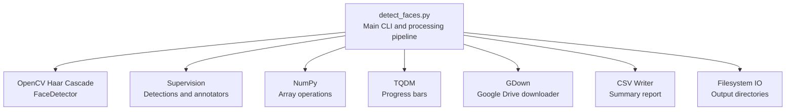
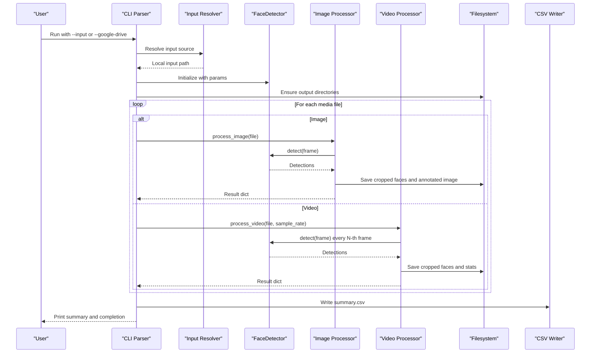
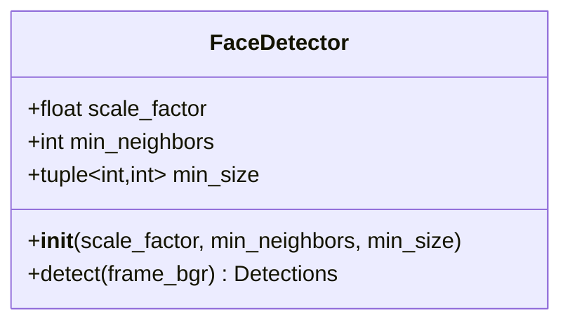
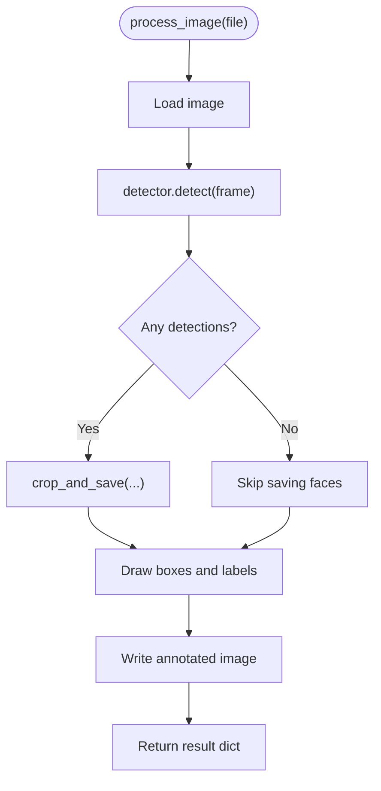
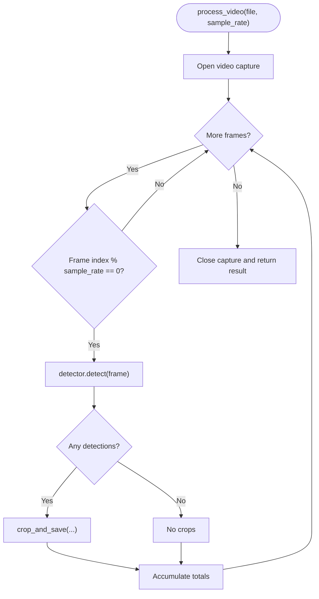
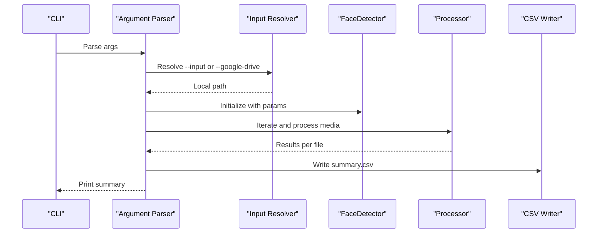
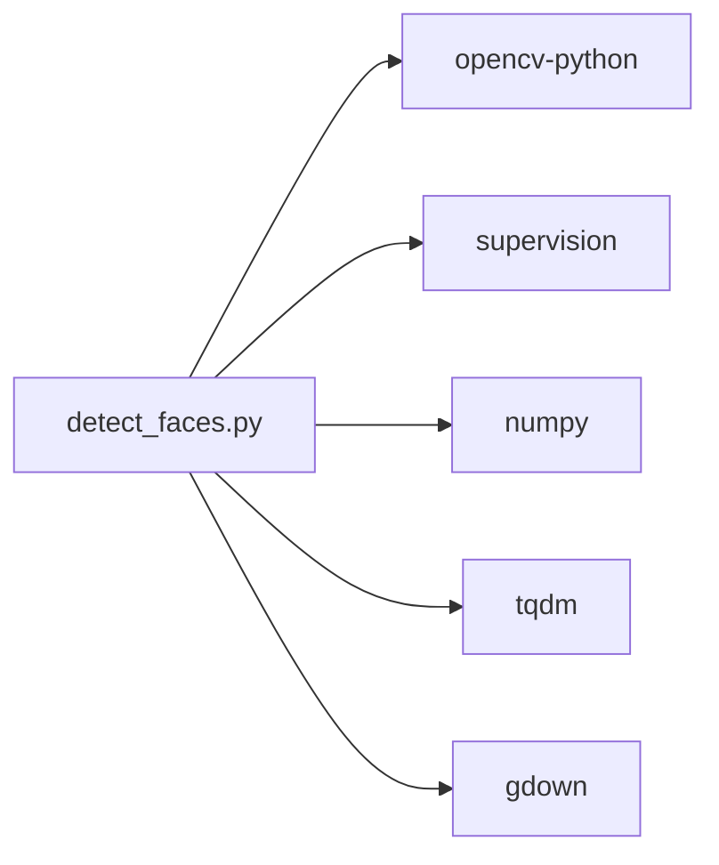

# Project Overview

<cite>
**Referenced Files in This Document**
- [detect_faces.py](file://detect_faces.py)
- [requirements.txt](file://requirements.txt)
- [.gitignore](file://.gitignore)
</cite>

## Table of Contents
1. [Introduction](#introduction)
2. [Project Structure](#project-structure)
3. [Core Components](#core-components)
4. [Architecture Overview](#architecture-overview)
5. [Detailed Component Analysis](#detailed-component-analysis)
6. [Dependency Analysis](#dependency-analysis)
7. [Performance Considerations](#performance-considerations)
8. [Troubleshooting Guide](#troubleshooting-guide)
9. [Conclusion](#conclusion)

## Introduction
CaptureFace is a practical, no-frills tool designed to detect and count human faces in photos and videos. Its primary goal is to simplify face detection workflows for both newcomers to computer vision and experienced developers who need a reliable, batch-oriented solution. The project focuses on:
- Scanning folders of images and videos
- Detecting faces using OpenCV Haar Cascades
- Saving cropped face images and annotated outputs
- Producing a CSV summary report and console logs

Key strengths:
- Built-in support for OpenCV’s Haar Cascade classifier (no extra model downloads)
- Batch processing across images and videos
- Optional Google Drive integration for remote datasets
- Clear, structured outputs for downstream tasks like dataset creation and basic facial analytics

## Project Structure
At a glance, the repository consists of:
- A single executable script that orchestrates detection, cropping, annotation, and reporting
- A requirements file declaring runtime dependencies
- A gitignore excluding build artifacts, logs, and temporary outputs

**Diagram sources**
- [detect_faces.py:99-137](file://detect_faces.py#L99-L137)
- [detect_faces.py:185-222](file://detect_faces.py#L185-L222)
- [detect_faces.py:227-286](file://detect_faces.py#L227-L286)
- [detect_faces.py:412-418](file://detect_faces.py#L412-L418)

**Section sources**
- [detect_faces.py:1-14](file://detect_faces.py#L1-L14)
- [requirements.txt:1-6](file://requirements.txt#L1-L6)
- [.gitignore:1-19](file://.gitignore#L1-L19)

## Core Components
CaptureFace centers around a small set of focused components that work together to deliver a streamlined face detection experience.

- FaceDetector: Wraps OpenCV’s Haar Cascade classifier and exposes a unified interface returning supervision Detections. It converts frames to grayscale, equalizes histograms, and runs detection with configurable parameters.
- Image processor: Loads an image, runs detection, saves cropped face images under an organized directory tree, and writes an annotated image with labeled bounding boxes.
- Video processor: Iterates through video frames at a configurable sample rate, detects faces, saves face crops with frame-scoped prefixes, and aggregates counts.
- Main pipeline: Parses arguments, resolves input (local or Google Drive), initializes the detector, iterates over media files, collects results, writes a CSV summary, and prints a human-readable summary.

Practical outcomes:
- Per-file face counts and error diagnostics
- Cropped face images for dataset creation
- Annotated images for quick visual verification
- A CSV summary for analytics and reporting

**Section sources**
- [detect_faces.py:99-137](file://detect_faces.py#L99-L137)
- [detect_faces.py:185-222](file://detect_faces.py#L185-L222)
- [detect_faces.py:227-286](file://detect_faces.py#L227-L286)
- [detect_faces.py:291-447](file://detect_faces.py#L291-L447)

## Architecture Overview
The system follows a linear, batch-oriented pipeline with clear separation of concerns:
- Input resolution: Local folder or Google Drive download
- Detection: OpenCV Haar Cascade via FaceDetector
- Output generation: Cropped faces, annotated images, CSV summary
- Progress and logging: TQDM progress bars and console summaries

**Diagram sources**
- [detect_faces.py:291-447](file://detect_faces.py#L291-L447)
- [detect_faces.py:185-222](file://detect_faces.py#L185-L222)
- [detect_faces.py:227-286](file://detect_faces.py#L227-L286)
- [detect_faces.py:412-418](file://detect_faces.py#L412-L418)

## Detailed Component Analysis

### FaceDetector: OpenCV Haar Cascade Wrapper
- Purpose: Provide a simple, configurable interface for face detection using OpenCV’s built-in Haar Cascade.
- Inputs: BGR frame (NumPy array)
- Outputs: supervision Detections with bounding boxes, confidences, and class IDs
- Key behaviors:
  - Converts input to grayscale and equalizes histogram for robustness
  - Runs detectMultiScale with tunable scale_factor, min_neighbors, and min_size
  - Returns empty detections when none are found

**Diagram sources**
- [detect_faces.py:99-137](file://detect_faces.py#L99-L137)

**Section sources**
- [detect_faces.py:99-137](file://detect_faces.py#L99-L137)

### Image Processing Workflow
- Loads an image, runs detection, and:
  - Saves cropped face images under an organized directory tree
  - Writes an annotated image with labeled bounding boxes
- Returns a result dictionary with file metadata, face counts, and saved crop counts

**Diagram sources**
- [detect_faces.py:185-222](file://detect_faces.py#L185-L222)
- [detect_faces.py:152-180](file://detect_faces.py#L152-L180)

**Section sources**
- [detect_faces.py:185-222](file://detect_faces.py#L185-L222)
- [detect_faces.py:152-180](file://detect_faces.py#L152-L180)

### Video Processing Workflow
- Opens the video, iterates through frames at a configurable sample rate, and:
  - Detects faces on sampled frames
  - Saves face crops with frame-scoped prefixes
  - Aggregates total faces and saved crops
- Returns a result dictionary including frames processed, total faces, and saved crop counts

**Diagram sources**
- [detect_faces.py:227-286](file://detect_faces.py#L227-L286)
- [detect_faces.py:152-180](file://detect_faces.py#L152-L180)

**Section sources**
- [detect_faces.py:227-286](file://detect_faces.py#L227-L286)
- [detect_faces.py:152-180](file://detect_faces.py#L152-L180)

### Main Pipeline and CLI
- Parses command-line arguments for input source, output directory, detector parameters, and video sampling
- Supports local input or Google Drive URLs/IDs
- Initializes the detector, enumerates media files, processes each file, and writes a CSV summary
- Prints a human-readable summary and cleans up temporary Google Drive downloads

**Diagram sources**
- [detect_faces.py:291-447](file://detect_faces.py#L291-L447)
- [detect_faces.py:412-418](file://detect_faces.py#L412-L418)

**Section sources**
- [detect_faces.py:291-447](file://detect_faces.py#L291-L447)
- [detect_faces.py:412-418](file://detect_faces.py#L412-L418)

## Dependency Analysis
CaptureFace relies on a small, focused set of libraries:
- OpenCV: Core computer vision primitives and Haar Cascade classifier
- supervision: Detection data structures and drawing utilities
- NumPy: Efficient array operations
- tqdm: Progress bars for interactive feedback
- gdown: Optional Google Drive integration

**Diagram sources**
- [requirements.txt:1-6](file://requirements.txt#L1-L6)
- [detect_faces.py:28-32](file://detect_faces.py#L28-L32)

**Section sources**
- [requirements.txt:1-6](file://requirements.txt#L1-L6)
- [detect_faces.py:28-32](file://detect_faces.py#L28-L32)

## Performance Considerations
- Sampling rate for videos: The video processor reads every N-th frame to balance speed and coverage. Adjusting the sample rate trades off accuracy against performance.
- Detector parameters: scale_factor, min_neighbors, and min_size influence detection sensitivity and speed. Larger min_size reduces false positives and speeds up detection.
- Memory and disk: Cropping and saving face images increases disk usage. Consider storage capacity and cleanup policies.
- Progress feedback: TQDM provides real-time progress updates, improving usability during long batches.

[No sources needed since this section provides general guidance]

## Troubleshooting Guide
Common issues and resolutions:
- Cannot open video: Videos may be corrupted or unsupported. Verify the file path and format.
- Cannot read image: The image file may be corrupted or inaccessible. Confirm permissions and file integrity.
- Google Drive download failures: Ensure the shared link or folder ID is correct and accessible. Temporary downloads are cleaned up automatically after processing.
- No faces detected: Adjust detector parameters (scale_factor, min_neighbors, min_size) or verify lighting and face orientation in the input media.
- Output directory conflicts: The script creates output subdirectories automatically. If collisions occur, change the output path.

**Section sources**
- [detect_faces.py:192-193](file://detect_faces.py#L192-L193)
- [detect_faces.py:238-239](file://detect_faces.py#L238-L239)
- [detect_faces.py:354-361](file://detect_faces.py#L354-L361)
- [detect_faces.py:439-442](file://detect_faces.py#L439-L442)

## Conclusion
CaptureFace delivers a straightforward, efficient solution for detecting and counting faces in photos and videos. It combines OpenCV’s Haar Cascades with a clean, batch-oriented pipeline, optional Google Drive integration, and clear outputs suitable for dataset creation and basic facial analytics. Its simplicity makes it approachable for beginners, while its modular design and configurable parameters offer practical value for experienced developers building data collection or analytics workflows.