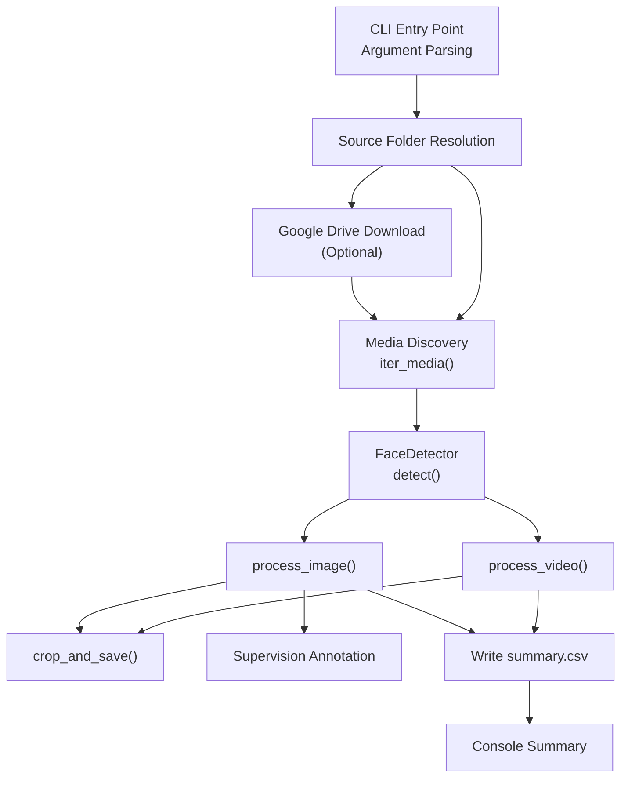
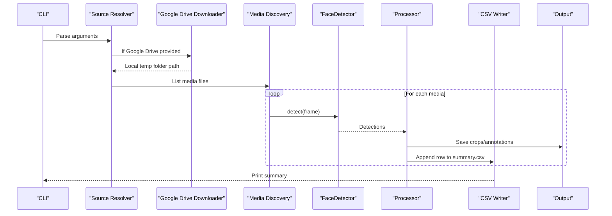
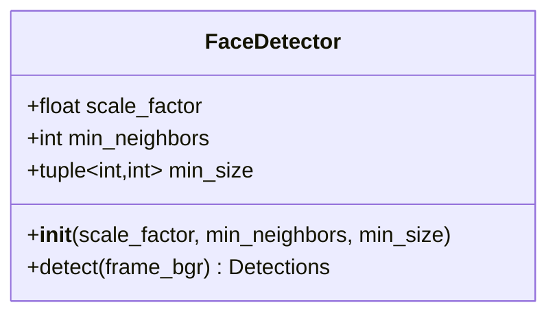
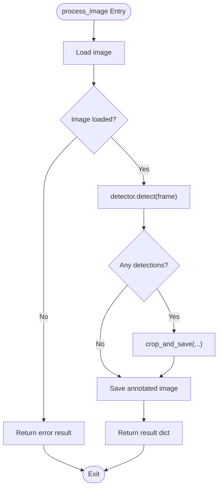
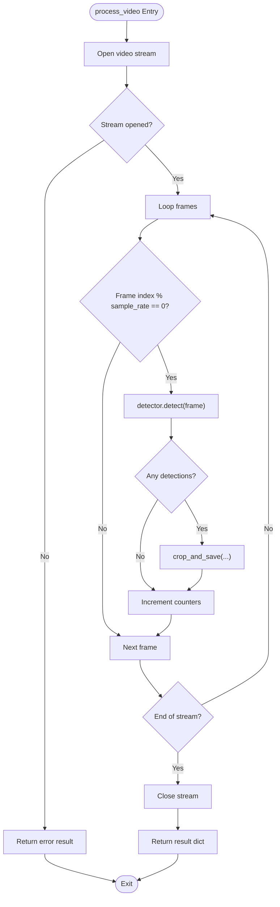
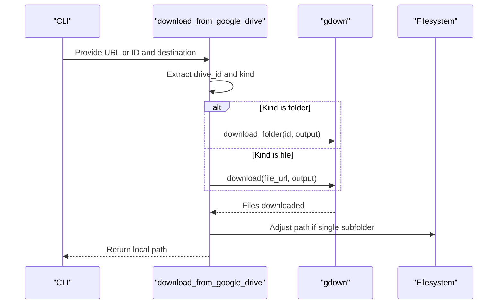
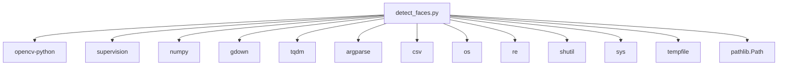

# Technical Reference

<cite>
**Referenced Files in This Document**
- [detect_faces.py](file://detect_faces.py)
- [requirements.txt](file://requirements.txt)
</cite>

## Table of Contents
1. [Introduction](#introduction)
2. [Project Structure](#project-structure)
3. [Core Components](#core-components)
4. [Architecture Overview](#architecture-overview)
5. [Detailed Component Analysis](#detailed-component-analysis)
6. [Dependency Analysis](#dependency-analysis)
7. [Performance Considerations](#performance-considerations)
8. [Troubleshooting Guide](#troubleshooting-guide)
9. [Conclusion](#conclusion)
10. [Appendices](#appendices)

## Introduction
This document provides a comprehensive technical reference for CaptureFace’s API and internal components. It focuses on the FaceDetector class interface, helper functions, file processing functions, detection result data structures, CSV output formats, error handling mechanisms, and integration points for extending functionality. The goal is to enable developers to programmatically use the system, understand its internals, and extend it safely.

## Project Structure
CaptureFace is a single-module Python application centered around a command-line interface that scans folders of images and videos, detects faces using OpenCV Haar Cascades, annotates detections, saves cropped face images, and writes a summary CSV report. The module also supports downloading media from a shared Google Drive folder.

Key elements:
- Command-line entry point and argument parsing
- FaceDetector class wrapping OpenCV Haar Cascades
- Helper functions for media discovery, directory creation, and cropping
- Image and video processing pipelines
- CSV summary writer
- Optional Google Drive integration

**Diagram sources**
- [detect_faces.py:291-447](file://detect_faces.py#L291-L447)
- [detect_faces.py:99-137](file://detect_faces.py#L99-L137)
- [detect_faces.py:141-146](file://detect_faces.py#L141-L146)
- [detect_faces.py:152-181](file://detect_faces.py#L152-L181)
- [detect_faces.py:185-223](file://detect_faces.py#L185-L223)
- [detect_faces.py:227-287](file://detect_faces.py#L227-L287)
- [detect_faces.py:412-418](file://detect_faces.py#L412-L418)

**Section sources**
- [detect_faces.py:10-14](file://detect_faces.py#L10-L14)
- [detect_faces.py:291-447](file://detect_faces.py#L291-L447)

## Core Components
This section documents the primary building blocks of the system: the FaceDetector class, helper functions, and processing pipelines.

- FaceDetector
  - Purpose: Encapsulates OpenCV Haar Cascade face detection with configurable parameters.
  - Methods:
    - detect(frame_bgr): Runs detection on a BGR image and returns a supervision Detections object.
  - Parameters:
    - scale_factor: Controls the image pyramid scaling per step.
    - min_neighbors: Minimum neighbors for a candidate rectangle to be accepted.
    - min_size: Minimum face size in pixels as (width, height).
  - Behavior:
    - Converts BGR to grayscale and equalizes histogram.
    - Uses detectMultiScale with configured parameters.
    - Returns empty detections when none are found; otherwise constructs a Detections object with bounding boxes, confidence, and class IDs.

- Helper Functions
  - iter_media(folder): Recursively yields all supported image and video paths under a given folder.
  - ensure_dir(path): Ensures a directory exists (creates parents as needed).
  - crop_and_save(frame, xyxy, save_dir, prefix, padding): Crops detected faces from frames and saves them as images with a standardized naming scheme.

- Image Processing
  - process_image(path, detector, output_dir): Loads an image, runs detection, saves annotated image, and optionally crops faces into a dedicated folder. Returns a dictionary with counts and metadata.

- Video Processing
  - process_video(path, detector, output_dir, sample_rate): Reads every N-th frame from a video, performs detection, and accumulates totals. Saves cropped faces per frame and returns a dictionary with counts and metadata.

- CSV Output
  - Writes a summary.csv file with columns: file, type, faces, saved_faces, error (when present).

- Google Drive Integration
  - download_from_google_drive(url_or_id, dest): Downloads a shared folder or file into a destination directory and returns the path to the downloaded content.

**Section sources**
- [detect_faces.py:99-137](file://detect_faces.py#L99-L137)
- [detect_faces.py:141-146](file://detect_faces.py#L141-L146)
- [detect_faces.py:148-149](file://detect_faces.py#L148-L149)
- [detect_faces.py:152-181](file://detect_faces.py#L152-L181)
- [detect_faces.py:185-223](file://detect_faces.py#L185-L223)
- [detect_faces.py:227-287](file://detect_faces.py#L227-L287)
- [detect_faces.py:412-418](file://detect_faces.py#L412-L418)
- [detect_faces.py:65-95](file://detect_faces.py#L65-L95)

## Architecture Overview
The system follows a modular pipeline:
- CLI resolves the input source (local folder or Google Drive).
- Media files are discovered and filtered by extension.
- For each media item, detection is performed using FaceDetector.
- Detected faces are cropped and saved; images are annotated and saved.
- Results are aggregated and written to a CSV summary.
- Optional cleanup removes temporary Google Drive downloads.

**Diagram sources**
- [detect_faces.py:291-447](file://detect_faces.py#L291-L447)
- [detect_faces.py:65-95](file://detect_faces.py#L65-L95)
- [detect_faces.py:141-146](file://detect_faces.py#L141-L146)
- [detect_faces.py:99-137](file://detect_faces.py#L99-L137)
- [detect_faces.py:185-223](file://detect_faces.py#L185-L223)
- [detect_faces.py:227-287](file://detect_faces.py#L227-L287)
- [detect_faces.py:412-418](file://detect_faces.py#L412-L418)

## Detailed Component Analysis

### FaceDetector Class
The FaceDetector class encapsulates OpenCV Haar Cascade face detection. It initializes with configurable parameters and exposes a single detect method that accepts a BGR image and returns a supervision Detections object.

**Diagram sources**
- [detect_faces.py:99-137](file://detect_faces.py#L99-L137)

Key behaviors:
- Initialization loads the default Haar cascade model from OpenCV data directory and validates it.
- detect converts the BGR frame to grayscale and equalizes the histogram to improve detection robustness.
- detectMultiScale is invoked with configured parameters to locate rectangles.
- If no detections are found, an empty Detections object is returned; otherwise, a Detections object is constructed with:
  - xyxy: array of bounding boxes in XYXY format
  - confidence: ones array matching detections
  - class_id: zeros array matching detections

Parameters and defaults:
- scale_factor: default 1.1
- min_neighbors: default 5
- min_size: default (30, 30)

Return value:
- supervision Detections object with fields described above.

Usage example (programmatic):
- Instantiate FaceDetector with desired parameters.
- Call detect on a BGR NumPy array.
- Use the returned Detections object to annotate images or crop faces.

**Section sources**
- [detect_faces.py:99-137](file://detect_faces.py#L99-L137)

### Helper Functions
- iter_media(folder)
  - Purpose: Recursively iterate over supported media files.
  - Input: Path-like object representing the root folder.
  - Output: Generator yielding Path objects for each supported file.
  - Supported extensions: Images (.jpg, .jpeg, .png, .bmp, .webp, .tiff, .tif); Videos (.mp4, .avi, .mov, .mkv, .wmv, .flv, .webm).

- ensure_dir(path)
  - Purpose: Ensure a directory exists, creating parent directories if needed.
  - Input: Path-like object.
  - Output: None.

- crop_and_save(frame, xyxy, save_dir, prefix, padding)
  - Purpose: Crop detected faces from a frame and save them as images.
  - Inputs:
    - frame: BGR image as NumPy array
    - xyxy: array of bounding boxes
    - save_dir: output directory Path
    - prefix: filename prefix string
    - padding: fractional padding ratio around the bounding box
  - Output: List of saved file Paths.

Behavior highlights:
- Applies padding to bounding boxes and clamps coordinates to image bounds.
- Skips zero-sized crops.
- Saves images with names following a standardized pattern.

**Section sources**
- [detect_faces.py:141-146](file://detect_faces.py#L141-L146)
- [detect_faces.py:148-149](file://detect_faces.py#L148-L149)
- [detect_faces.py:152-181](file://detect_faces.py#L152-L181)

### Image Processing Pipeline
process_image(path, detector, output_dir) performs detection on a single image:
- Loads the image using OpenCV.
- Handles read failures by returning an error result.
- Runs detector.detect to obtain Detections.
- Saves annotated image with supervision BoxAnnotator and LabelAnnotator.
- Optionally crops faces into a subfolder named after the image stem.
- Returns a dictionary with keys: file, type, faces, saved_faces.

**Diagram sources**
- [detect_faces.py:185-223](file://detect_faces.py#L185-L223)
- [detect_faces.py:99-137](file://detect_faces.py#L99-L137)
- [detect_faces.py:152-181](file://detect_faces.py#L152-L181)

**Section sources**
- [detect_faces.py:185-223](file://detect_faces.py#L185-L223)

### Video Processing Pipeline
process_video(path, detector, output_dir, sample_rate) processes a video by sampling frames:
- Opens the video stream and handles opening failures.
- Iterates frames, sampling every N-th frame according to sample_rate.
- For each sampled frame, runs detector.detect and accumulates totals.
- Saves cropped faces per frame into a subfolder named after the video stem.
- Returns a dictionary with keys: file, type, frames_processed, faces, saved_faces.

**Diagram sources**
- [detect_faces.py:227-287](file://detect_faces.py#L227-L287)
- [detect_faces.py:99-137](file://detect_faces.py#L99-L137)
- [detect_faces.py:152-181](file://detect_faces.py#L152-L181)

**Section sources**
- [detect_faces.py:227-287](file://detect_faces.py#L227-L287)

### CSV Output Format
The system writes a summary.csv file with the following columns:
- file: Basename of the processed media file
- type: Either "image" or "video"
- faces: Total number of faces detected
- saved_faces: Number of face crops saved
- error: Optional error message when processing failed

The writer uses DictWriter with extrasaction set to ignore extra keys, ensuring robustness against unexpected result dictionaries.

**Section sources**
- [detect_faces.py:412-418](file://detect_faces.py#L412-L418)

### Google Drive Integration
download_from_google_drive(url_or_id, dest) supports downloading shared Google Drive folders or files:
- Parses the input to extract a folder or file ID.
- Uses gdown to download into the destination directory.
- If gdown creates a single subfolder, the function returns that subfolder path; otherwise, it returns the destination path.
- The CLI orchestrates temporary folder creation and cleanup.

**Diagram sources**
- [detect_faces.py:65-95](file://detect_faces.py#L65-L95)

**Section sources**
- [detect_faces.py:65-95](file://detect_faces.py#L65-L95)

## Dependency Analysis
External dependencies and their roles:
- OpenCV (cv2): Provides image loading, grayscale conversion, histogram equalization, and Haar Cascade detection.
- supervision: Provides Detections data structure and annotation utilities (BoxAnnotator, LabelAnnotator, ColorLookup).
- NumPy: Used for array operations and constructing Detections arrays.
- gdown: Downloads shared Google Drive folders and files.
- tqdm: Progress bars during video processing.
- argparse, csv, os, re, shutil, sys, tempfile, pathlib: Standard library modules for CLI, filesystem, regex, and CSV writing.

**Diagram sources**
- [detect_faces.py:18-32](file://detect_faces.py#L18-L32)
- [requirements.txt:1-6](file://requirements.txt#L1-L6)

**Section sources**
- [detect_faces.py:18-32](file://detect_faces.py#L18-L32)
- [requirements.txt:1-6](file://requirements.txt#L1-L6)

## Performance Considerations
- Haar Cascade parameters:
  - scale_factor controls the image pyramid step; higher values reduce recall but speed up processing.
  - min_neighbors reduces false positives; higher values increase precision but may miss small faces.
  - min_size determines the smallest searchable region; larger sizes improve speed but miss tiny faces.
- Video sampling:
  - sample_rate determines how many frames are processed; increasing it reduces runtime but may miss faces in fast motion scenes.
- Cropping and saving:
  - Cropping adds overhead proportional to the number of detections; disabling or reducing padding can improve throughput.
- Annotation:
  - Supervision annotation incurs additional rendering costs; disable or reduce annotations for batch processing.

[No sources needed since this section provides general guidance]

## Troubleshooting Guide
Common issues and resolutions:
- Cannot read image:
  - Symptom: Result dictionary includes an error key with value indicating inability to read.
  - Cause: Corrupted or unsupported image format.
  - Resolution: Verify file integrity and supported extensions.
- Cannot open video:
  - Symptom: Result dictionary includes an error key indicating failure to open.
  - Cause: Unsupported codec or corrupted file.
  - Resolution: Re-encode the video or use a compatible container.
- Haar cascade load failure:
  - Symptom: Runtime error during detector initialization.
  - Cause: Missing or incompatible OpenCV data files.
  - Resolution: Install opencv-python with data files or reinstall the package.
- Google Drive download errors:
  - Symptom: Failure to download or empty output directory.
  - Cause: Invalid URL/ID or network issues.
  - Resolution: Confirm the shared link permissions and try again; ensure gdown is installed.

**Section sources**
- [detect_faces.py:192-193](file://detect_faces.py#L192-L193)
- [detect_faces.py:238-239](file://detect_faces.py#L238-L239)
- [detect_faces.py:106-107](file://detect_faces.py#L106-L107)
- [detect_faces.py:65-95](file://detect_faces.py#L65-L95)

## Conclusion
CaptureFace provides a focused, extensible pipeline for detecting faces in images and videos. The FaceDetector class offers a clean interface for detection, while helper functions and processing pipelines handle discovery, cropping, annotation, and reporting. The CSV summary and optional Google Drive integration streamline batch workflows. Extensibility points include replacing the detector backend, adjusting detection parameters, and adding new output formats.

[No sources needed since this section summarizes without analyzing specific files]

## Appendices

### Programmatic Usage Examples
- Initialize detector with custom parameters and detect faces in an image:
  - Instantiate FaceDetector with scale_factor, min_neighbors, and min_size.
  - Load a BGR image as a NumPy array.
  - Call detector.detect to obtain Detections.
  - Use supervision utilities to annotate or crop faces.
  - Save outputs to disk and record results in a dictionary for CSV export.

- Process a folder of media programmatically:
  - Use iter_media to discover supported files.
  - For each Path, call process_image or process_video depending on extension.
  - Aggregate results and write summary.csv using the provided writer.

- Integrate Google Drive downloads:
  - Use download_from_google_drive to fetch shared content into a temporary directory.
  - Process the resulting folder with the existing pipelines.
  - Clean up the temporary directory after completion.

**Section sources**
- [detect_faces.py:99-137](file://detect_faces.py#L99-L137)
- [detect_faces.py:141-146](file://detect_faces.py#L141-L146)
- [detect_faces.py:185-223](file://detect_faces.py#L185-L223)
- [detect_faces.py:227-287](file://detect_faces.py#L227-L287)
- [detect_faces.py:65-95](file://detect_faces.py#L65-L95)
- [detect_faces.py:412-418](file://detect_faces.py#L412-L418)