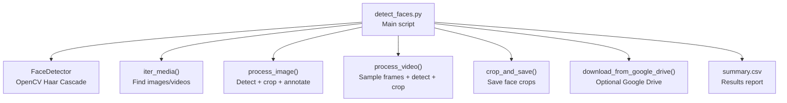
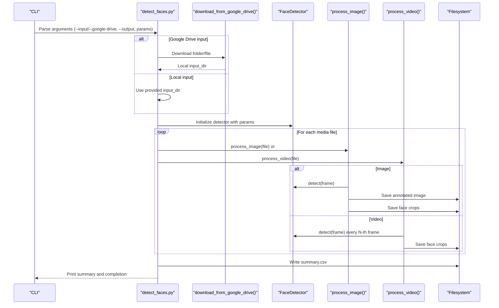
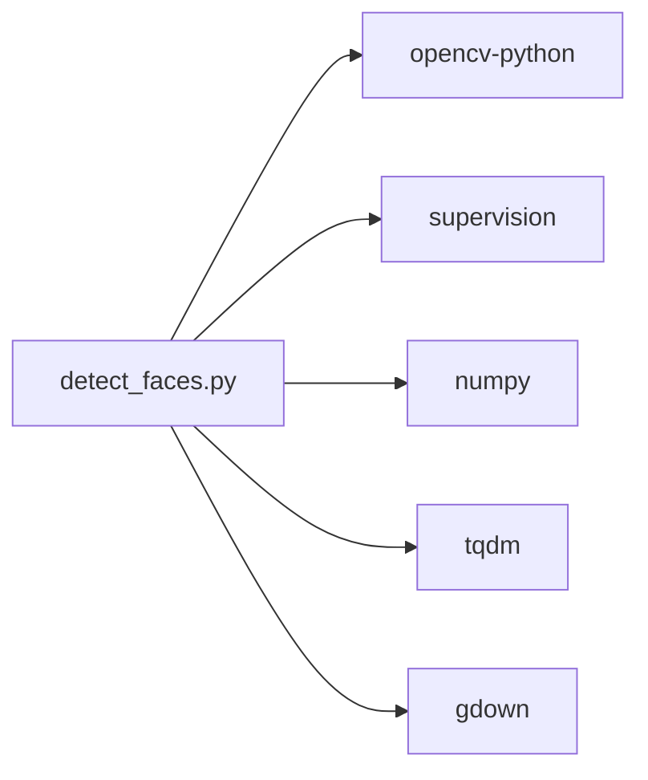

# Usage Examples

<cite>
**Referenced Files in This Document**
- [detect_faces.py](file://detect_faces.py)
- [requirements.txt](file://requirements.txt)
- [.gitignore](file://.gitignore)
</cite>

## Table of Contents
1. [Introduction](#introduction)
2. [Project Structure](#project-structure)
3. [Core Components](#core-components)
4. [Architecture Overview](#architecture-overview)
5. [Detailed Component Analysis](#detailed-component-analysis)
6. [Dependency Analysis](#dependency-analysis)
7. [Performance Considerations](#performance-considerations)
8. [Troubleshooting Guide](#troubleshooting-guide)
9. [Conclusion](#conclusion)
10. [Appendices](#appendices)

## Introduction
This document provides practical usage examples for CaptureFace, a tool that scans folders of photos and videos, detects faces using OpenCV Haar Cascades, saves cropped face images, and reports counts per file and in total. It covers common use cases such as batch processing photo collections, video face detection workflows, dataset creation for machine learning, and automated face counting scenarios. It also explains output organization, file structure, and integration patterns with other tools.

## Project Structure
CaptureFace consists of a single script that orchestrates downloading from Google Drive (optional), scanning media files, detecting faces, saving cropped faces, annotating images, and writing a summary CSV. The output directory organizes results into subfolders for faces and annotated images.

**Diagram sources**
- [detect_faces.py:99-137](file://detect_faces.py#L99-L137)
- [detect_faces.py:141-146](file://detect_faces.py#L141-L146)
- [detect_faces.py:185-223](file://detect_faces.py#L185-L223)
- [detect_faces.py:227-287](file://detect_faces.py#L227-L287)
- [detect_faces.py:152-181](file://detect_faces.py#L152-L181)
- [detect_faces.py:65-95](file://detect_faces.py#L65-L95)
- [detect_faces.py:412-418](file://detect_faces.py#L412-L418)

**Section sources**
- [detect_faces.py:10-14](file://detect_faces.py#L10-L14)
- [detect_faces.py:348-384](file://detect_faces.py#L348-L384)

## Core Components
- FaceDetector: Wraps OpenCV Haar Cascades to detect faces in BGR frames. It exposes a detect method returning supervision Detections with bounding boxes, confidences, and class IDs.
- Media discovery: iter_media recursively enumerates supported image and video files under a given folder.
- Image processing: process_image loads an image, runs detection, saves cropped faces into a per-image subfolder, and writes an annotated image with labeled bounding boxes.
- Video processing: process_video samples frames at a configurable rate, detects faces, saves cropped faces with frame-indexed prefixes, and tracks totals.
- Cropping and saving: crop_and_save pads bounding boxes slightly, crops regions, and writes face images to disk.
- Google Drive integration: download_from_google_drive accepts a shared folder URL or ID, downloads files locally, and returns the target folder path.
- Output organization: results are written to a summary CSV and face crops are organized under an output directory with dedicated subfolders.

**Section sources**
- [detect_faces.py:99-137](file://detect_faces.py#L99-L137)
- [detect_faces.py:141-146](file://detect_faces.py#L141-L146)
- [detect_faces.py:185-223](file://detect_faces.py#L185-L223)
- [detect_faces.py:227-287](file://detect_faces.py#L227-L287)
- [detect_faces.py:152-181](file://detect_faces.py#L152-L181)
- [detect_faces.py:65-95](file://detect_faces.py#L65-L95)
- [detect_faces.py:412-418](file://detect_faces.py#L412-L418)

## Architecture Overview
The tool follows a straightforward pipeline: resolve input (local or Google Drive), initialize the detector, iterate media files, process each item, and produce a summary CSV. Progress bars and logging inform users during execution.

**Diagram sources**
- [detect_faces.py:291-447](file://detect_faces.py#L291-L447)
- [detect_faces.py:65-95](file://detect_faces.py#L65-L95)
- [detect_faces.py:99-137](file://detect_faces.py#L99-L137)
- [detect_faces.py:185-223](file://detect_faces.py#L185-L223)
- [detect_faces.py:227-287](file://detect_faces.py#L227-L287)
- [detect_faces.py:412-418](file://detect_faces.py#L412-L418)

## Detailed Component Analysis

### Command-Line Usage Patterns
Below are practical command-line examples for typical workflows. Replace placeholders with your actual paths and values.

- Basic batch processing of a local folder:
  - Example: python detect_faces.py --input ./my_photos --output ./output
  - Notes: Scans images and videos recursively, detects faces, saves annotated images and face crops, and writes a summary CSV.

- Process a Google Drive shared folder:
  - Example: python detect_faces.py --google-drive https://drive.google.com/drive/folders/XXXXX --output ./output
  - Notes: Downloads the shared folder into a temporary location, processes media, and cleans up the temp folder afterward.

- Process a Google Drive file/folder ID:
  - Example: python detect_faces.py --google-drive FOLDER_ID --output ./output
  - Notes: Accepts a bare ID; assumes folder if long, otherwise file.

- Tune detection sensitivity and minimum face size:
  - Example: python detect_faces.py --input ./my_photos --output ./output --scale-factor 1.05 --min-neighbors 8 --min-size 25 25
  - Notes: Lower scale factor increases recall at potential cost of false positives; higher min neighbors reduces false positives; smaller min size detects smaller faces.

- Adjust video sampling rate:
  - Example: python detect_faces.py --input ./videos --output ./output --sample-rate 10
  - Notes: Processes every N-th frame to reduce runtime for long videos.

- Combine Google Drive with tuning:
  - Example: python detect_faces.py --google-drive SHARED_URL --output ./output --scale-factor 1.15 --sample-rate 3
  - Notes: Good for large shared drives with many videos.

**Section sources**
- [detect_faces.py:10-14](file://detect_faces.py#L10-L14)
- [detect_faces.py:291-346](file://detect_faces.py#L291-L346)
- [detect_faces.py:354-361](file://detect_faces.py#L354-L361)

### Output Organization and File Structure
After processing, the output directory contains:
- summary.csv: Per-file breakdown with columns including file, type, faces, saved_faces, and error (if any).
- faces/: A subfolder per media file, containing cropped face images named with a prefix derived from the file stem and index. For images, the prefix is the file stem; for videos, the prefix includes the file stem plus frame index.
- annotated/: Annotated copies of input images with labeled bounding boxes drawn around detected faces.

Example layout:
- output/
  - summary.csv
  - faces/
    - image_name/
      - image_name_face_000.jpg
      - image_name_face_001.jpg
      - ...
    - video_name/
      - video_name_f000000_face_000.jpg
      - video_name_f000000_face_001.jpg
      - ...
  - annotated/
    - image_name.jpg

Notes:
- Face crops are saved with slight padding around bounding boxes to include more context.
- For videos, face crops are saved per sampled frame to balance speed and coverage.

**Section sources**
- [detect_faces.py:199-222](file://detect_faces.py#L199-L222)
- [detect_faces.py:243-286](file://detect_faces.py#L243-L286)
- [detect_faces.py:152-181](file://detect_faces.py#L152-L181)
- [detect_faces.py:412-418](file://detect_faces.py#L412-L418)

### Common Use Cases and Workflows

#### Batch Processing Photo Collections
- Scenario: You have a large collection of family photos and want to extract all faces for later review or cataloging.
- Steps:
  - Prepare a local folder with images.
  - Run the basic batch command to scan, detect, annotate, and crop faces.
  - Review output/annotated for verification and output/faces for curated datasets.
- Tips:
  - Increase min-neighbors to reduce false positives if you see many small artifacts.
  - Decrease min-size to capture smaller faces (e.g., children) if needed.

**Section sources**
- [detect_faces.py:10-14](file://detect_faces.py#L10-L14)
- [detect_faces.py:377-384](file://detect_faces.py#L377-L384)

#### Video Face Detection Workflows
- Scenario: You have surveillance footage or recorded events and need to identify presence and approximate counts.
- Steps:
  - Place video files in a folder.
  - Use a moderate sample-rate (e.g., 5) to balance speed and coverage.
  - Inspect output/annotated for verification and output/faces for face instances.
- Tips:
  - For very long videos, increase sample-rate to reduce processing time.
  - Use lower scale-factor and higher min-neighbors for stricter detection.

**Section sources**
- [detect_faces.py:227-287](file://detect_faces.py#L227-L287)
- [detect_faces.py:341-345](file://detect_faces.py#L341-L345)

#### Dataset Creation for Machine Learning
- Scenario: You need a labeled dataset of cropped faces for training or evaluation.
- Steps:
  - Organize raw media into a single input folder.
  - Run the tool to generate face crops and a summary CSV.
  - Use the summary CSV to track counts and organize crops into class folders if desired.
- Tips:
  - Validate annotated images to ensure good quality crops.
  - Consider splitting output/faces into train/validation/test sets manually or via downstream scripts.

**Section sources**
- [detect_faces.py:199-222](file://detect_faces.py#L199-L222)
- [detect_faces.py:243-286](file://detect_faces.py#L243-L286)
- [detect_faces.py:412-418](file://detect_faces.py#L412-L418)

#### Automated Face Counting Scenarios
- Scenario: You need quick counts across many images or videos.
- Steps:
  - Use the basic command-line pattern to process the folder.
  - Review the printed summary and summary.csv for totals.
- Tips:
  - For videos, adjust sample-rate to meet time budgets.
  - For large batches, consider running on a powerful machine or cloud VM.

**Section sources**
- [detect_faces.py:420-436](file://detect_faces.py#L420-L436)
- [detect_faces.py:412-418](file://detect_faces.py#L412-L418)

### Advanced Usage Patterns and Workflow Optimization
- Parameter tuning:
  - scale-factor: Controls pyramid scaling; smaller values increase recall but may add noise.
  - min-neighbors: Higher values reduce false positives; tune based on image quality and lighting.
  - min-size: Smaller values detect tiny faces; larger values filter noise.
- Sampling strategy:
  - For videos, increase sample-rate to reduce runtime; decrease to improve coverage.
- Google Drive integration:
  - Use shared folder URLs or IDs; the tool downloads into a temporary folder and processes locally.
- Post-processing:
  - Use summary.csv to drive downstream tasks (e.g., filtering low-confidence detections, merging counts).
- Environment isolation:
  - Install dependencies in a virtual environment to avoid conflicts.

**Section sources**
- [detect_faces.py:317-339](file://detect_faces.py#L317-L339)
- [detect_faces.py:341-345](file://detect_faces.py#L341-L345)
- [detect_faces.py:65-95](file://detect_faces.py#L65-L95)

## Dependency Analysis
CaptureFace relies on several libraries for computer vision, annotation, progress reporting, and Google Drive downloads.

**Diagram sources**
- [requirements.txt:1-6](file://requirements.txt#L1-L6)
- [detect_faces.py:28-32](file://detect_faces.py#L28-L32)

**Section sources**
- [requirements.txt:1-6](file://requirements.txt#L1-L6)

## Performance Considerations
- Video sampling: The default sample-rate balances speed and coverage; increase it for longer videos to reduce processing time.
- Detection parameters: Adjust scale-factor and min-neighbors to trade off precision and recall.
- Memory and I/O: Large videos and many images can consume memory and disk I/O; monitor progress bars and free space.
- Parallelization: The script processes files sequentially; consider splitting large input folders into chunks and running multiple instances if needed.

[No sources needed since this section provides general guidance]

## Troubleshooting Guide
- Input folder not found:
  - Symptom: Error indicating the input folder does not exist.
  - Action: Verify the path and permissions; ensure the folder exists.
- Cannot read image/video:
  - Symptom: Per-file error reported in summary.csv and console output.
  - Action: Check file integrity and supported formats; remove corrupted files.
- Google Drive download issues:
  - Symptom: Failure to download shared folder or file.
  - Action: Confirm the shared link or ID is accessible; retry with a stable network connection.
- Cleanup of temporary folder:
  - Symptom: Temporary folder remains after execution.
  - Action: The script attempts cleanup automatically; if interrupted, remove the temp folder manually.

**Section sources**
- [detect_faces.py:363-365](file://detect_faces.py#L363-L365)
- [detect_faces.py:392-391](file://detect_faces.py#L392-L391)
- [detect_faces.py:440-442](file://detect_faces.py#L440-L442)

## Conclusion
CaptureFace offers a practical solution for batch face detection across images and videos, with robust output organization and flexible tuning options. By combining local processing with optional Google Drive integration, it supports diverse workflows from dataset creation to automated counting. Use the provided examples and tips to tailor the tool to your specific needs and optimize performance for large-scale tasks.

[No sources needed since this section summarizes without analyzing specific files]

## Appendices

### Appendix A: Output Fields in summary.csv
- file: Basename of the input media file.
- type: Either image or video.
- faces: Total number of faces detected across the file.
- saved_faces: Number of face crops saved to disk.
- error: Optional field indicating processing errors encountered.

**Section sources**
- [detect_faces.py:412-418](file://detect_faces.py#L412-L418)

### Appendix B: Supported File Extensions
- Images: jpg, jpeg, png, bmp, webp, tiff, tif
- Videos: mp4, avi, mov, mkv, wmv, flv, webm

**Section sources**
- [detect_faces.py:34-36](file://detect_faces.py#L34-L36)

### Appendix C: Environment Setup
- Create and activate a virtual environment.
- Install dependencies from requirements.txt.
- Run the script with your chosen arguments.

**Section sources**
- [requirements.txt:1-6](file://requirements.txt#L1-L6)